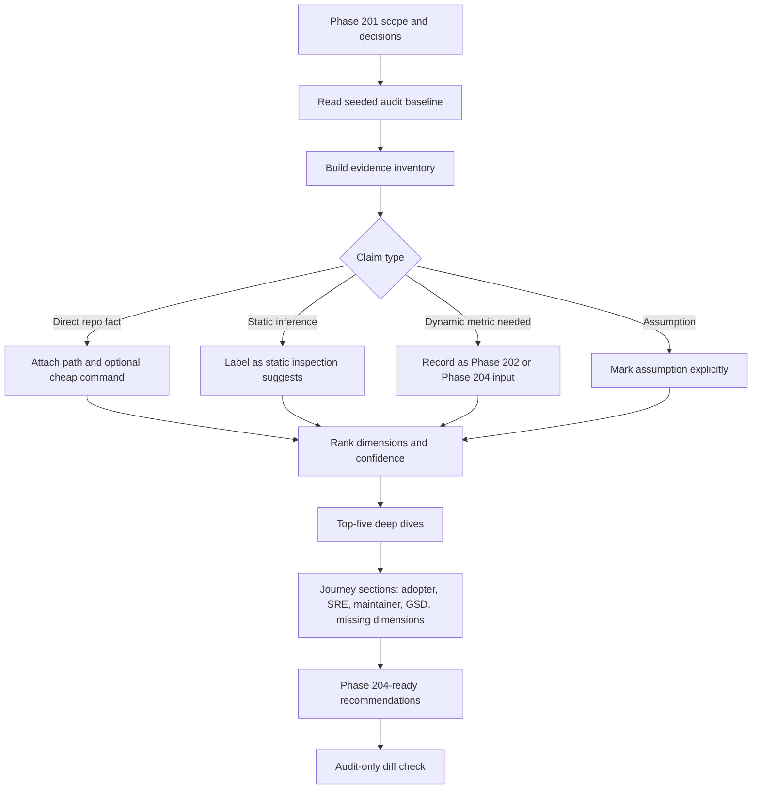

# Phase 201: Software Quality Evaluation - Research

**Researched:** 2026-07-02  
**Domain:** Audit-only OSS billing library quality evaluation for an Elixir/Phoenix monorepo [VERIFIED: .planning/phases/201-software-quality-evaluation/201-CONTEXT.md]  
**Confidence:** HIGH for repository scope and local evidence; MEDIUM for external standards framing [VERIFIED: repo inspection; CITED: https://owasp.org/www-project-application-security-verification-standard/]

<user_constraints>
## User Constraints (from CONTEXT.md)

The following constraints are copied from `.planning/phases/201-software-quality-evaluation/201-CONTEXT.md`; this block is the locked planning input for Phase 201. [VERIFIED: .planning/phases/201-software-quality-evaluation/201-CONTEXT.md]

### Locked Decisions

## Implementation Decisions

### Audit Stance And Bluntness
- **D-01:** Use a **balanced release-readiness report with a blunt scored core**. Preserve rankings, 1-5 scores, confidence, top-five weakness deep dives, and blunt maintainer-facing language, but frame scores as release-readiness triage rather than a public report card.
- **D-02:** The audit voice must follow Accrue's committed brand voice: measured, exact, Phoenix-native, durable, mechanism-led, and proof-checkable. Avoid hype, generic adjectives, and public shaming. Statements like "production-ready but audit-heavy" are acceptable when backed by evidence and concrete consequences.
- **D-03:** The audit must mark strong and not-applicable dimensions honestly. Do not manufacture concerns to fill a matrix. If a dimension is strong, say why and move on.

### Evidence Boundary
- **D-04:** Static repo evidence is the primary evidence source. Every low score, concern, and recommendation must cite concrete local paths or explicitly label itself as an assumption.
- **D-05:** Limited cheap command verification is allowed when it improves confidence without turning Phase 201 into a verification milestone. Good examples: `rg`, `find`, `wc`, package metadata inspection, docs/link checks, or narrowly scoped deterministic Mix commands if already cheap and relevant.
- **D-06:** Full `mix verify.full`, Docker boot proof, live Stripe, GitHub run-history analysis, flake-rate metrics, and external scorecards are not required for Phase 201. When relevant, record them as "metrics needed" or follow-up inputs for Phase 202 / Phase 204.
- **D-07:** Dynamic claims need clear labeling. The audit can say static inspection suggests CI duplication or provider-lane ambiguity, but measured p50/p95 runtime, cache hit rates, and flake rates belong to Phase 202 unless live data is explicitly collected there.

### Scope Split With Phases 202 And 203
- **D-08:** Use an **integrated summary with explicit handoff** for CI/CD and DB schema. Phase 201 should rank CI/CD signal fidelity and schema-prefix safety as quality risks, explain why they matter to adoption/production/support trust, and cite the local evidence.
- **D-09:** Do not duplicate Phase 202's CI topology, critical-path, cache, flakiness, and target-pipeline analysis inside Phase 201. Link and summarize. Phase 202 owns implementation-grade CI/CD recommendations and measurements.
- **D-10:** Do not duplicate Phase 203's DB schema ADR inside Phase 201. Phase 201 should state that schema-prefix drift is a data/upgrade safety risk; Phase 203 owns the accepted `billing` default, explicit `public` posture, Ecto prefix reasoning, and future hardening checks.
- **D-11:** Phase 204 should consume Phase 201 as the cross-quality ranking input and consume Phases 202/203 for specialist evidence. Avoid double-counting the same CI or DB risk as multiple unrelated roadmap items.

### Folded Todos
- **D-12:** Fold `White-label billing portal design system` as supporting evidence for the portal parity/customer portal UX weakness. It is not Phase 201 implementation scope. Phase 204 may rank a future `accrue_portal` readiness/design-system/white-label pass if the audit confirms adopter-risk value.
- **D-13:** Treat `Shared page_header component for accrue_admin list pages` as resolved/positive design-system evidence, not a current weakness. PageHeader shipped in v1.54 and should only be mentioned as proof that stale todos need hygiene if still pending.
- **D-14:** Treat `Use the Accrue favicon in the brandbook HTML` as valid deferred polish. It can improve public-trust polish, but it does not reduce enough adoption, production, support, or maintenance risk to become a Phase 201 weakness by itself.

### Cross-Cutting Product And DX Lens
- **D-15:** Recommendations must be coherent with Accrue's stable-core vision: a Phoenix developer can install Accrue plus the companion admin/portal packages and launch a real SaaS billing loop with clear state, strong proof paths, and low surprise.
- **D-16:** The primary personas for the audit are: first-time Phoenix SaaS evaluator, production adopter, maintainer/reviewer, support/debugging maintainer, operator using `accrue_admin`, and customer using `accrue_portal`.
- **D-17:** For API and docs findings, evaluate from the consumer's perspective, not the provider's internal elegance. Host apps should see clear facades, exact ownership boundaries, and least-surprise setup. Do not expose backend guts unless they are fundamental to safe integration.
- **D-18:** For UI/UX findings, apply JTBD, accessibility, performance, responsive behavior, dark/light/system theming, focus/hover affordances, microcopy, and brand consistency. `accrue_admin` is recently strong; `accrue_portal` needs proportionate parity because it is customer-facing.
- **D-19:** Use lessons from Pay, Laravel Cashier, Stripe, Phoenix/Ecto/Plug, Oban, and successful OSS projects: framework-native vocabulary, small clear public facades, strong examples, test doubles/proof paths, precise provider-boundary docs, and honest operational guidance. Avoid footguns: overclaiming provider parity, hiding lifecycle semantics, stale public version truth, raw provider detail leakage, and scorecards with false precision.

### the agent's Discretion

### Claude's Discretion
- The planner/researcher may choose the exact table layout, score labels, and appendix structure as long as D-01 through D-19 hold.
- The planner/researcher may select cheap supporting commands, but must keep them bounded and label command outputs as supporting evidence rather than full release proof.
- The planner/researcher may tune wording to match the brandbook voice, but must not soften real risks into vague prose.

### Folded Todos
- **White-label billing portal design system** (`.planning/todos/pending/2026-06-19-white-label-billing-portal-design-system.md`) — Folded as evidence for portal parity and customer-facing white-label evidence. The todo's implementation remains future scope.
- **Shared page_header component for accrue_admin list pages** (`.planning/todos/pending/2026-06-21-shared-page-header-component-for-accrue-admin.md`) — Folded as reviewed/resolved evidence. Do not treat as an active weakness.
- **Use the Accrue favicon in the brandbook HTML** (`.planning/todos/pending/2026-06-19-brandbook-use-accrue-favicon.md`) — Folded as reviewed deferred polish. Mention only if the audit has a low-priority public-trust polish section.

### Deferred Ideas (OUT OF SCOPE)

## Deferred Ideas

- Future `accrue_portal` readiness/design-system/white-label milestone or hardening slice, if Phase 204 ranks it high enough from audit evidence.
- Brandbook favicon HTML polish.
- Todo hygiene to close or archive the resolved PageHeader pending todo.
- Phase 202 live GitHub run-history metrics, CI duration/cache/flake baseline, and provider proved-vs-skipped counts.
- Future implementation milestone for schema-prefix guards and raw SQL qualification checks.
- Any actual CI topology changes, DB defaults, UI styling changes, package metadata changes, or release automation changes.
</user_constraints>

<phase_requirements>
## Phase Requirements

| ID | Description | Research Support |
|----|-------------|------------------|
| QLT-01 | Maintainer can read one evidence-backed audit that ranks Accrue's weakest adoption, production, maintenance, support, architecture, data, UI, security, release, upgrade, and OSS trust dimensions without treating every category as equally important. [VERIFIED: .planning/REQUIREMENTS.md] | Use a ranked dimension table with score, confidence, evidence paths, consequence, highest-leverage fix, and priority; do not use an equal-weight checklist. [VERIFIED: .planning/phases/201-software-quality-evaluation/201-SOFTWARE-QUALITY-AUDIT.md] |
| QLT-02 | The audit identifies the top five weakness deep dives with repo evidence, practical consequences, highest-leverage fixes, and what not to over-fix. [VERIFIED: .planning/REQUIREMENTS.md] | Preserve the seeded top-five deep-dive shape and require each deep dive to include observation, why it matters, evidence paths, user/maintainer pain, fix first, and do-not-over-fix. [VERIFIED: .planning/phases/201-software-quality-evaluation/201-SOFTWARE-QUALITY-AUDIT.md] |
| QLT-03 | The audit separately covers adopter journey, production/SRE journey, maintainer journey, GSD sanity, and missing project-specific dimensions. [VERIFIED: .planning/REQUIREMENTS.md] | Keep separate journey sections and add an Accrue-specific dimension pass for provider proof semantics, schema-prefix safety, billing temporal correctness, release train coherence, and evaluator proof ergonomics. [VERIFIED: .planning/phases/201-software-quality-evaluation/201-SOFTWARE-QUALITY-AUDIT.md] |
| QLT-04 | The audit marks strong or not-applicable dimensions honestly instead of manufacturing fake concerns. [VERIFIED: .planning/REQUIREMENTS.md] | Use a score/confidence/priority model where strong dimensions can be marked maintain or not applicable with a short rationale and no fake recommendation. [VERIFIED: .planning/phases/201-software-quality-evaluation/201-CONTEXT.md] |
| QLT-05 | The audit separates direct repo facts from assumptions and cites evidence paths for low scores. [VERIFIED: .planning/REQUIREMENTS.md] | Add an evidence map or appendix with claim, score impact, local path or command, confidence, and assumption label where direct evidence is missing. [VERIFIED: .planning/phases/201-software-quality-evaluation/201-CONTEXT.md] |
</phase_requirements>

## Summary

Phase 201 should refine the seeded `201-SOFTWARE-QUALITY-AUDIT.md` into a bounded, evidence-backed release-readiness triage artifact, not a code-change or verification milestone. [VERIFIED: .planning/ROADMAP.md] The planner should create one plan that samples local repository evidence across public docs, package READMEs, CI maps, release docs, security/community files, package manifests, admin/portal UI surfaces, folded todos, and adjacent Phase 202/203 artifacts. [VERIFIED: .planning/phases/201-software-quality-evaluation/201-CONTEXT.md]

The strongest planning constraint is evidence provenance: every low score, concern, and recommendation must cite concrete repository paths or be labeled as an assumption. [VERIFIED: .planning/phases/201-software-quality-evaluation/201-CONTEXT.md] Cheap static commands are allowed, but full host proof, Docker boot proof, live Stripe proof, GitHub run-history metrics, and external scorecards are explicitly out of scope for this phase. [VERIFIED: .planning/phases/201-software-quality-evaluation/201-CONTEXT.md]

External standards are useful only as framing: OWASP ASVS can structure the security coverage checklist, GitHub community profile guidance can frame OSS trust files, Stripe docs can frame sandbox/go-live/provider-proof separation, and OpenSSF Scorecard can be listed as optional future input rather than Phase 201 evidence. [CITED: https://owasp.org/www-project-application-security-verification-standard/] [CITED: https://docs.github.com/en/communities/setting-up-your-project-for-healthy-contributions/about-community-profiles-for-public-repositories] [CITED: https://docs.stripe.com/get-started/checklist/go-live] [CITED: https://openssf.org/projects/scorecard/]

**Primary recommendation:** Plan one audit-production pass that turns the seeded audit into a traceable evidence map plus ranked findings, while preserving the audit-only boundary and handing CI/CD and DB-specialist details to Phases 202 and 203. [VERIFIED: .planning/phases/201-software-quality-evaluation/201-CONTEXT.md]

## Project Constraints (from CLAUDE.md)

- Accrue targets Elixir/Phoenix billing library users, with `accrue`, `accrue_admin`, and `accrue_portal` as sibling package surfaces. [VERIFIED: CLAUDE.md]
- The project stack constraint in `CLAUDE.md` names Elixir 1.17+, OTP 27+, Phoenix 1.8+, Ecto 3.12+, and PostgreSQL 14+ as baseline constraints, while current package manifests and CI use Elixir `~> 1.19` and OTP 28. [VERIFIED: CLAUDE.md] [VERIFIED: rg in accrue/mix.exs accrue_admin/mix.exs accrue_portal/mix.exs .github/workflows/ci.yml]
- Webhook signature verification is mandatory, raw-body plug ordering matters, sensitive Stripe fields must not be logged, and payment method details are stored as provider references rather than PII. [VERIFIED: CLAUDE.md]
- The monorepo ownership boundary is `accrue` for billing domain/public facades, `accrue_admin` for operator UI, `accrue_portal` for customer self-serve UI, and host apps for Repo, migrations, Oban supervision, auth, session, runtime secrets, routes, and app-domain policy. [VERIFIED: CLAUDE.md] [VERIFIED: .planning/PROJECT.md]
- `CLAUDE.md` says project skills were not found, and direct filesystem checks found no `.claude/skills`, `.agents/skills`, or `.codex/skills` directories with `SKILL.md`. [VERIFIED: CLAUDE.md] [VERIFIED: find .claude .agents .codex]
- No `AGENTS.md` exists in the project root, so there are no additional `AGENTS.md` directives to enforce. [VERIFIED: find .. -maxdepth 2 -name AGENTS.md]

## Architectural Responsibility Map

| Capability | Primary Tier | Secondary Tier | Rationale |
|------------|--------------|----------------|-----------|
| Software-quality audit artifact | Planning / Documentation | Repository evidence | The deliverable is `.planning/phases/201-software-quality-evaluation/201-SOFTWARE-QUALITY-AUDIT.md`, and the phase explicitly does not change runtime behavior. [VERIFIED: .planning/ROADMAP.md] |
| Adoption and evaluator clarity assessment | Documentation / Examples | CI proof paths | The first-user path is documented through root README, package README, host README, First Hour, and proof matrices; CI is evidence only where it affects proof trust. [VERIFIED: README.md] [VERIFIED: accrue/README.md] |
| Production/SRE/supportability assessment | Documentation / Runbooks | Backend runtime surfaces | The audit should read production readiness, troubleshooting, telemetry, release, and support docs, then sample runtime boundaries only as evidence paths. [VERIFIED: accrue/README.md] [VERIFIED: scripts/ci/README.md] |
| UI/UX quality assessment | Frontend packages | Design-system evidence | `accrue_admin` and `accrue_portal` are the UI surfaces; recent PageHeader/Storybook work is positive admin evidence, while portal parity is a customer-facing risk. [VERIFIED: accrue_admin/README.md] [VERIFIED: accrue_portal/README.md] |
| CI/CD signal-fidelity assessment | CI configuration | Phase 202 specialist artifact | Phase 201 may rank CI signal fidelity as a quality risk, but Phase 202 owns topology, timings, cache, flake, and target-pipeline detail. [VERIFIED: .planning/phases/202-ci-cd-performance-and-determinism-audit/202-CI-CD-PERFORMANCE-AUDIT.md] |
| DB schema-prefix safety assessment | Data layer | Phase 203 specialist artifact | Phase 201 should summarize schema-prefix drift as data/upgrade risk, while Phase 203 owns the accepted `billing` default and hardening checks. [VERIFIED: .planning/phases/203-database-schema-contract-adr/203-DB-SCHEMA-CONTRACT-ADR.md] |
| Security and OSS trust assessment | Documentation / Repo policy | Backend and CI evidence | Security coverage spans SECURITY.md, webhook/signature docs, auth/session ownership, dependency/license/community files, and ASVS-relevant controls. [VERIFIED: SECURITY.md] [CITED: https://docs.github.com/code-security/getting-started/adding-a-security-policy-to-your-repository] |

## Standard Stack

### Core

| Library / Tool | Version | Purpose | Why Standard |
|----------------|---------|---------|--------------|
| Markdown planning artifact | n/a | Canonical audit deliverable | Phase 201 is audit-only and writes `201-SOFTWARE-QUALITY-AUDIT.md`; no application code package is required. [VERIFIED: .planning/ROADMAP.md] |
| `rg` | 15.1.0 | Fast repo evidence search | Static repository evidence is the primary evidence source, and ripgrep is available locally. [VERIFIED: rg --version] |
| `git` | 2.41.0 | Diff boundary and no-behavior-change verification | The phase must prove it changed only the audit artifact and not product behavior or CI topology. [VERIFIED: git --version] |
| `wc`, `find`, shell built-ins | system tools | Cheap evidence counts and file inventory | The context explicitly allows bounded commands such as `find` and `wc` when they improve confidence. [VERIFIED: .planning/phases/201-software-quality-evaluation/201-CONTEXT.md] |
| Existing seeded audit | n/a | Starting audit baseline | The seeded audit already contains dimension ranking, top-five deep dives, journey sections, missing dimensions, and top hardening candidates. [VERIFIED: .planning/phases/201-software-quality-evaluation/201-SOFTWARE-QUALITY-AUDIT.md] |

### Supporting

| Library / Tool | Version | Purpose | When to Use |
|----------------|---------|---------|-------------|
| Elixir / Mix | Elixir 1.19.5, Mix 1.19.5, OTP 28 | Optional deterministic project inspection | Use only for cheap metadata or narrowly scoped deterministic commands; do not run `mix verify.full` for Phase 201. [VERIFIED: elixir --version] [VERIFIED: mix --version] |
| Node / npm | Node 22.14.0, npm 11.1.0 | Optional front-end metadata inspection | Use only if checking package metadata or existing Playwright/script surfaces; do not add a new Node-based audit tool. [VERIFIED: node --version] [VERIFIED: npm --version] |
| `gh` | 2.95.0 | Optional GitHub run-history lookup | Do not use for Phase 201 unless the planner explicitly records the result as extra dynamic evidence; live run-history metrics belong to Phase 202. [VERIFIED: gh --version] [VERIFIED: .planning/phases/201-software-quality-evaluation/201-CONTEXT.md] |
| PostgreSQL client `psql` | 14.17 | Optional DB metadata check | Phase 201 should not require live DB checks; psql availability matters only if the planner chooses a cheap local schema metadata sample. [VERIFIED: psql --version] |

### Alternatives Considered

| Instead of | Could Use | Tradeoff |
|------------|-----------|----------|
| Local evidence map | OpenSSF Scorecard | External scorecards are explicitly not required for Phase 201, and their output would not satisfy the local-evidence requirement by itself. [VERIFIED: .planning/phases/201-software-quality-evaluation/201-CONTEXT.md] [CITED: https://openssf.org/projects/scorecard/] |
| Seeded audit refinement | Fresh generic quality matrix | A generic matrix risks false precision and manufactured concerns; the seeded artifact already encodes Accrue-specific dimensions and handoffs. [VERIFIED: .planning/phases/201-software-quality-evaluation/201-SOFTWARE-QUALITY-AUDIT.md] |
| Bounded static commands | Full host/prod verification | Full verification is out of scope and belongs to implementation or specialist phases; Phase 201 records missing metrics as follow-up inputs. [VERIFIED: .planning/phases/201-software-quality-evaluation/201-CONTEXT.md] |

**Installation:**

```bash
# No new package installation is recommended for Phase 201.
```

**Version verification:** Existing local tools were checked with `rg --version`, `git --version`, `elixir --version`, `mix --version`, `node --version`, `npm --version`, `gh --version`, and `psql --version`. [VERIFIED: local command output]

## Package Legitimacy Audit

No external package install is recommended for Phase 201, so the package-legitimacy gate has no packages to evaluate. [VERIFIED: .planning/ROADMAP.md]

| Package | Registry | Age | Downloads | Source Repo | Verdict | Disposition |
|---------|----------|-----|-----------|-------------|---------|-------------|
| none | n/a | n/a | n/a | n/a | n/a | No install planned. [VERIFIED: phase scope] |

**Packages removed due to [SLOP] verdict:** none. [VERIFIED: no packages recommended]  
**Packages flagged as suspicious [SUS]:** none. [VERIFIED: no packages recommended]

## Architecture Patterns

### System Architecture Diagram



This flow keeps the audit tied to repository evidence, separates direct facts from inferred or missing dynamic metrics, and produces Phase 204-ready ranking without changing code. [VERIFIED: .planning/phases/201-software-quality-evaluation/201-CONTEXT.md]

### Recommended Project Structure

```text
.planning/phases/201-software-quality-evaluation/
├── 201-CONTEXT.md                 # locked user decisions and scope [VERIFIED]
├── 201-RESEARCH.md                # planner input produced by this phase research [VERIFIED]
├── 201-01-PLAN.md                 # single implementation plan to create/refine the audit [VERIFIED: .planning/ROADMAP.md]
└── 201-SOFTWARE-QUALITY-AUDIT.md  # canonical audit deliverable [VERIFIED: .planning/ROADMAP.md]
```

### Pattern 1: Evidence Map Before Scoring

**What:** Build or update a claim-level evidence map before finalizing scores. [VERIFIED: .planning/phases/201-software-quality-evaluation/201-CONTEXT.md]  
**When to use:** Use this for every low score, concern, top-five weakness, and Phase 204 recommendation. [VERIFIED: .planning/REQUIREMENTS.md]  
**Example:**

```markdown
| Claim | Dimension | Evidence | Command / Inspection | Confidence | Audit Use |
|-------|-----------|----------|----------------------|------------|-----------|
| Toolchain truth drift exists between public docs and current manifests. | Release / OSS trust | `CONTRIBUTING.md`, `accrue/mix.exs`, `.github/workflows/ci.yml` | `rg -n "elixir|otp|@version" ...` | High | Low score evidence + Phase 204 input |
```

Source: seeded audit and local `rg` verification. [VERIFIED: .planning/phases/201-software-quality-evaluation/201-SOFTWARE-QUALITY-AUDIT.md] [VERIFIED: rg command output]

### Pattern 2: Scored Release-Readiness Triage

**What:** Keep a 1-5 score, confidence, priority, practical consequence, and highest-leverage fix per dimension. [VERIFIED: .planning/phases/201-software-quality-evaluation/201-CONTEXT.md]  
**When to use:** Use this for QLT-01 so dimensions are ranked by impact rather than treated as equal checklist rows. [VERIFIED: .planning/REQUIREMENTS.md]  
**Example:**

```markdown
| Rank | Dimension | Score | Confidence | Evidence | Practical consequence | Highest-leverage fix | Priority |
|---:|---|---:|---|---|---|---|---|
| 1 | CI/CD signal fidelity | 3 | High | `.github/workflows/ci.yml`; `scripts/ci/README.md`; Phase 202 artifact | "Green" can become hard to interpret | Measure and clarify lanes before demotion | should fix before public push |
```

Source: existing audit table shape. [VERIFIED: .planning/phases/201-software-quality-evaluation/201-SOFTWARE-QUALITY-AUDIT.md]

### Pattern 3: Specialist Handoff, Not Duplication

**What:** Summarize CI/CD and DB schema risks in Phase 201, then point to Phase 202 and Phase 203 for implementation-grade detail. [VERIFIED: .planning/phases/201-software-quality-evaluation/201-CONTEXT.md]  
**When to use:** Use this for CI/CD efficiency/signal fidelity and schema-prefix safety findings. [VERIFIED: .planning/phases/202-ci-cd-performance-and-determinism-audit/202-CI-CD-PERFORMANCE-AUDIT.md] [VERIFIED: .planning/phases/203-database-schema-contract-adr/203-DB-SCHEMA-CONTRACT-ADR.md]  
**Example:**

```markdown
**Handoff:** Phase 201 ranks CI signal fidelity as an adoption/support trust risk. Phase 202 owns job topology, timing baselines, cache behavior, flake history, and target pipeline recommendations.
```

Source: context D-08 through D-11. [VERIFIED: .planning/phases/201-software-quality-evaluation/201-CONTEXT.md]

### Pattern 4: Recommendation Rows That Phase 204 Can Rank

**What:** Each recommended follow-up should include area, quality dimension improved, impact, effort, risk reduction, timing, done criteria, and what not to over-fix. [VERIFIED: .planning/REQUIREMENTS.md]  
**When to use:** Use this for the final ranked candidate list and top-five weakness deep dives. [VERIFIED: .planning/phases/204-ranked-hardening-roadmap/204-HARDENING-ROADMAP.md]  
**Example:**

```markdown
| Recommendation | Evidence | Impact | Effort | Risk Reduction | Done Criteria | Not Over-Fix |
|----------------|----------|--------|--------|----------------|---------------|--------------|
| Create one evaluator proof path. | README/front-door docs evidence | High | Low | High | 3-5 command path with pass/fail criteria | Do not rewrite the full docs corpus |
```

Source: seeded audit and Phase 204 draft roadmap. [VERIFIED: .planning/phases/201-software-quality-evaluation/201-SOFTWARE-QUALITY-AUDIT.md] [VERIFIED: .planning/phases/204-ranked-hardening-roadmap/204-HARDENING-ROADMAP.md]

### Anti-Patterns to Avoid

- **Generic OSS advice without local evidence:** It violates QLT-05 because low scores and concerns must cite repository evidence or be labeled assumptions. [VERIFIED: .planning/REQUIREMENTS.md]
- **Changing product behavior while auditing:** Phase 201 must not change public APIs, DB defaults, CI required-check topology, release automation, or UI/runtime implementation. [VERIFIED: .planning/ROADMAP.md]
- **Duplicating Phase 202 and 203:** CI/CD and DB details should be summarized and handed off, not re-owned by Phase 201. [VERIFIED: .planning/phases/201-software-quality-evaluation/201-CONTEXT.md]
- **Manufacturing weak scores:** Strong or not-applicable dimensions must be marked honestly. [VERIFIED: .planning/phases/201-software-quality-evaluation/201-CONTEXT.md]
- **Treating skipped or advisory provider lanes as proof:** Provider proof semantics must separate proved, skipped, advisory, Fake, sandbox, and live claims. [VERIFIED: README.md] [CITED: https://docs.stripe.com/billing/testing]

## Don't Hand-Roll

| Problem | Don't Build | Use Instead | Why |
|---------|-------------|-------------|-----|
| Security coverage frame | Custom security taxonomy | OWASP ASVS categories as a checklist | ASVS is a recognized web application security verification standard, and it covers the major web-app control areas Phase 201 needs to audit. [CITED: https://owasp.org/www-project-application-security-verification-standard/] |
| OSS trust frame | A bespoke community-health checklist only | GitHub community profile files plus local evidence | GitHub checks README, CODE_OF_CONDUCT, LICENSE, CONTRIBUTING, templates, and SECURITY-style files for public repository health. [CITED: https://docs.github.com/en/communities/setting-up-your-project-for-healthy-contributions/about-community-profiles-for-public-repositories] |
| Billing provider proof frame | Vague "Stripe tested" language | Fake/local, sandbox/provider, and live/go-live separation | Stripe documentation separates sandbox testing, webhook/customer-portal testing, and go-live readiness. [CITED: https://docs.stripe.com/billing/testing] [CITED: https://docs.stripe.com/get-started/checklist/go-live] |
| CI/CD audit detail | Rewriting Phase 202 inside Phase 201 | Phase 202 handoff summary | Phase 202 is the specialist CI/CD audit and already owns topology, metrics, cache, flake, and target pipeline recommendations. [VERIFIED: .planning/phases/202-ci-cd-performance-and-determinism-audit/202-CI-CD-PERFORMANCE-AUDIT.md] |
| DB schema ADR detail | Rewriting Phase 203 inside Phase 201 | Phase 203 handoff summary | Phase 203 already accepts `billing` as the default schema and owns future schema-prefix hardening checks. [VERIFIED: .planning/phases/203-database-schema-contract-adr/203-DB-SCHEMA-CONTRACT-ADR.md] |
| New scoring engine | Scripted score calculator | Human-reviewed ranked table with evidence | The phase needs blunt maintainer-facing triage, not false precision from a calculator. [VERIFIED: .planning/phases/201-software-quality-evaluation/201-CONTEXT.md] |

**Key insight:** The audit's value comes from Accrue-specific evidence and prioritization, not from inventing a new quality framework or running a broad external scorecard. [VERIFIED: .planning/phases/201-software-quality-evaluation/201-CONTEXT.md]

## Common Pitfalls

### Pitfall 1: Low Scores Without Evidence

**What goes wrong:** A finding reads like generic OSS advice instead of an Accrue-specific risk. [VERIFIED: .planning/REQUIREMENTS.md]  
**Why it happens:** The writer scores a category before building the claim-level evidence map. [VERIFIED: .planning/phases/201-software-quality-evaluation/201-SOFTWARE-QUALITY-AUDIT.md]  
**How to avoid:** Require each low score and recommendation to cite at least one local path or to be moved into the assumptions log. [VERIFIED: .planning/phases/201-software-quality-evaluation/201-CONTEXT.md]  
**Warning signs:** The finding contains no path, no command, and no repo-specific consequence. [VERIFIED: .planning/REQUIREMENTS.md]

### Pitfall 2: Audit Scope Becomes Implementation Scope

**What goes wrong:** The phase changes CI topology, package metadata, DB defaults, UI code, or release automation while producing the audit. [VERIFIED: .planning/ROADMAP.md]  
**Why it happens:** The seeded audit already names concrete fixes, so the planner may treat them as implementation tasks. [VERIFIED: .planning/phases/201-software-quality-evaluation/201-SOFTWARE-QUALITY-AUDIT.md]  
**How to avoid:** Put all follow-up work into recommendation rows for Phase 204 and validate the diff is limited to the audit artifact and planning files. [VERIFIED: .planning/phases/204-ranked-hardening-roadmap/204-HARDENING-ROADMAP.md]  
**Warning signs:** A task edits `.github/workflows`, `mix.exs`, source code, CSS, migrations, or release workflows. [VERIFIED: .planning/ROADMAP.md]

### Pitfall 3: Double-Counting CI or DB Risk

**What goes wrong:** One CI or DB risk appears as several unrelated high-priority findings. [VERIFIED: .planning/phases/201-software-quality-evaluation/201-CONTEXT.md]  
**Why it happens:** Phase 201, 202, and 203 overlap by design unless handoffs are explicit. [VERIFIED: .planning/ROADMAP.md]  
**How to avoid:** Use one integrated summary row for CI/CD and one for schema-prefix safety, then link specialist artifacts for details. [VERIFIED: .planning/phases/202-ci-cd-performance-and-determinism-audit/202-CI-CD-PERFORMANCE-AUDIT.md] [VERIFIED: .planning/phases/203-database-schema-contract-adr/203-DB-SCHEMA-CONTRACT-ADR.md]  
**Warning signs:** The audit repeats Phase 202's target pipeline table or Phase 203's ADR rationale in full. [VERIFIED: .planning/phases/201-software-quality-evaluation/201-CONTEXT.md]

### Pitfall 4: False Precision From External Scorecards

**What goes wrong:** An external score is treated as the authoritative quality grade for Accrue. [VERIFIED: .planning/phases/201-software-quality-evaluation/201-CONTEXT.md]  
**Why it happens:** Automated checks are attractive shortcuts for OSS trust. [CITED: https://openssf.org/projects/scorecard/]  
**How to avoid:** Record external scorecards as optional future inputs and keep Phase 201 scoring anchored in local evidence. [VERIFIED: .planning/phases/201-software-quality-evaluation/201-CONTEXT.md]  
**Warning signs:** A finding cites only a scorecard and no local path. [VERIFIED: .planning/REQUIREMENTS.md]

### Pitfall 5: Softening the Audit Voice

**What goes wrong:** Real risks become vague prose that Phase 204 cannot rank. [VERIFIED: brandbook/voice.md]  
**Why it happens:** The audit tries to avoid sounding negative. [VERIFIED: .planning/phases/201-software-quality-evaluation/201-CONTEXT.md]  
**How to avoid:** Use measured, exact, mechanism-led language with concrete consequences and no public shaming. [VERIFIED: brandbook/voice.md]  
**Warning signs:** The text uses adjectives like "robust" or "modern" without naming the mechanism or evidence. [VERIFIED: brandbook/voice.md]

## Code Examples

Verified patterns for the planner to require in the audit artifact:

### Evidence Appendix Row

```markdown
| Finding | Evidence Path | Evidence Type | Command / Inspection | Confidence | Assumption? |
|---------|---------------|---------------|----------------------|------------|-------------|
| Portal parity is a customer-facing maturity risk. | `accrue_portal/README.md`; `.planning/todos/pending/2026-06-19-white-label-billing-portal-design-system.md`; `accrue_portal/lib/accrue_portal/live/subscriptions_live.ex` | direct repo evidence | read README/todo/source; inspect unstyled link and CSS surface | Medium | no |
```

Source: portal README, folded todo, and portal LiveView/CSS inspection. [VERIFIED: accrue_portal/README.md] [VERIFIED: .planning/todos/pending/2026-06-19-white-label-billing-portal-design-system.md] [VERIFIED: accrue_portal/lib/accrue_portal/live/subscriptions_live.ex]

### Diff Boundary Check

```bash
git diff --name-only -- . \
  | rg -v '^(.planning/phases/201-software-quality-evaluation/201-SOFTWARE-QUALITY-AUDIT.md|.planning/phases/201-software-quality-evaluation/201-RESEARCH.md|.planning/phases/201-software-quality-evaluation/201-01-PLAN.md)$'
```

Source: Phase 201 audit-only boundary. [VERIFIED: .planning/ROADMAP.md]

### Cheap Evidence Commands

```bash
rg -n "elixir|otp|@version" accrue/mix.exs accrue_admin/mix.exs accrue_portal/mix.exs CONTRIBUTING.md .github/workflows/ci.yml
wc -l README.md accrue/README.md accrue_admin/README.md accrue_portal/README.md CONTRIBUTING.md RELEASING.md SECURITY.md scripts/ci/README.md .github/workflows/ci.yml
rg --files -g '*_test.exs' accrue/test accrue_admin/test accrue_portal/test examples/accrue_host/test | wc -l
```

Source: locally verified command set used during research. [VERIFIED: local command output]

## State of the Art

| Old Approach | Current Approach | When Changed | Impact |
|--------------|------------------|--------------|--------|
| Generic public report card | Balanced release-readiness report with blunt scored core | Locked in Phase 201 context on 2026-07-02 | Keeps rankings and consequences without public shaming or false precision. [VERIFIED: .planning/phases/201-software-quality-evaluation/201-CONTEXT.md] |
| Broad feature expansion after stable core | Audit-only maintenance and hardening roadmap milestone | v1.55 active on 2026-07-01 | Preserves stable-core posture and defers implementation to Phase 204-ranked follow-ups. [VERIFIED: .planning/PROJECT.md] |
| Treat CI green as one undifferentiated proof | Separate merge-blocking, advisory, scheduled, Fake, sandbox, and live proof semantics | Existing root README and Phase 202 audit | Prevents provider-overclaiming and keeps dynamic metrics in the specialist phase. [VERIFIED: README.md] [VERIFIED: .planning/phases/202-ci-cd-performance-and-determinism-audit/202-CI-CD-PERFORMANCE-AUDIT.md] |
| Treat DB schema rename as possible Phase 201 work | Keep `billing` default and summarize schema-prefix safety risk | Phase 203 ADR accepted on 2026-07-01 | Avoids upgrade-sensitive default changes while preserving a hardening path. [VERIFIED: .planning/phases/203-database-schema-contract-adr/203-DB-SCHEMA-CONTRACT-ADR.md] |
| One-size-fits-all security checklist | ASVS-informed audit coverage tied to local evidence | External standard checked during research | Gives security coverage structure without claiming a formal security assessment. [CITED: https://devguide.owasp.org/en/03-requirements/05-asvs/] |

**Deprecated/outdated:**

- Treating Phase 201 as a verification milestone is out of date for v1.55 because full `mix verify.full`, Docker boot proof, live Stripe, GitHub run history, and external scorecards are not required. [VERIFIED: .planning/phases/201-software-quality-evaluation/201-CONTEXT.md]
- Treating `accrue_admin` PageHeader as an active weakness is out of date because Phase 201 context says it shipped in v1.54 and should be positive/resolved evidence. [VERIFIED: .planning/phases/201-software-quality-evaluation/201-CONTEXT.md]
- Treating brandbook favicon polish as a Phase 201 weakness is out of scope because context classifies it as deferred polish. [VERIFIED: .planning/phases/201-software-quality-evaluation/201-CONTEXT.md]

## Assumptions Log

All claims in this research were verified from local repository files, local commands, or official documentation searched during this session. [VERIFIED: repo inspection] [CITED: https://docs.github.com/en/communities/setting-up-your-project-for-healthy-contributions/about-community-profiles-for-public-repositories]

| # | Claim | Section | Risk if Wrong |
|---|-------|---------|---------------|
| none | No unverified assumption is intentionally used as a planning basis. [VERIFIED: sources listed below] | n/a | n/a |

## Open Questions (RESOLVED)

1. **How many cheap Mix commands should the executor run?** [VERIFIED: .planning/phases/201-software-quality-evaluation/201-CONTEXT.md]
   - What we know: Cheap deterministic commands are allowed, but full verification commands are not required. [VERIFIED: .planning/phases/201-software-quality-evaluation/201-CONTEXT.md]
   - RESOLVED decision: Phase 201 should not require Mix commands. Use `rg`, `wc`, `find`, package metadata inspection, and artifact checks as the default evidence path; permit a narrowly scoped Mix command only if static inspection cannot resolve a specific disputed claim and the command is bounded enough to fit the Phase 201 artifact-check feedback window. [VERIFIED: .planning/phases/201-software-quality-evaluation/201-CONTEXT.md] [VERIFIED: .planning/phases/201-software-quality-evaluation/201-VALIDATION.md]
   - Planning impact: The PLAN.md task checks use shell artifact inspection and diff-boundary checks; broad project verification remains out of scope for Phase 201. [VERIFIED: .planning/phases/201-software-quality-evaluation/201-01-PLAN.md]

2. **Should the seeded audit keep the exact rank order?** [VERIFIED: .planning/phases/201-software-quality-evaluation/201-SOFTWARE-QUALITY-AUDIT.md]
   - What we know: The context preserves rankings, scores, confidence, and top-five deep dives. [VERIFIED: .planning/phases/201-software-quality-evaluation/201-CONTEXT.md]
   - RESOLVED decision: Keep the seeded relative rank order, scores, confidence labels, and top-five weakness set unless new local evidence found during Task 1 directly changes a score or confidence label; allowed edits are table layout, evidence appendix, labels, and proof-checkable wording. [VERIFIED: .planning/phases/201-software-quality-evaluation/201-CONTEXT.md] [VERIFIED: .planning/phases/201-software-quality-evaluation/201-SOFTWARE-QUALITY-AUDIT.md]
   - Planning impact: Task 2 refines the scored audit and journey sections without replacing the seeded audit with a generic matrix or softening the locked risks. [VERIFIED: .planning/phases/201-software-quality-evaluation/201-01-PLAN.md]

## Environment Availability

| Dependency | Required By | Available | Version | Fallback |
|------------|-------------|-----------|---------|----------|
| `rg` | Evidence search | yes | 15.1.0 | `grep`/`find`, but slower. [VERIFIED: rg --version] |
| `git` | Diff boundary check | yes | 2.41.0 | Manual file list review, lower confidence. [VERIFIED: git --version] |
| Elixir | Optional project metadata checks | yes | 1.19.5 with OTP 28 | Avoid Mix commands and use static file inspection. [VERIFIED: elixir --version] |
| Mix | Optional project metadata checks | yes | 1.19.5 with OTP 28 | Avoid Mix commands and use static file inspection. [VERIFIED: mix --version] |
| Node | Optional package/front-end metadata checks | yes | 22.14.0 | Avoid Node commands and inspect files. [VERIFIED: node --version] |
| npm | Optional package/front-end metadata checks | yes | 11.1.0 | Avoid npm commands and inspect files. [VERIFIED: npm --version] |
| GitHub CLI `gh` | Optional live run-history lookup | yes | 2.95.0 | Do not collect live run history in Phase 201; record as Phase 202 input. [VERIFIED: gh --version] |
| PostgreSQL client `psql` | Optional DB metadata sample | yes | 14.17 | Use static schema/config evidence; Phase 203 owns DB detail. [VERIFIED: psql --version] |

**Missing dependencies with no fallback:** none for the recommended Phase 201 audit plan. [VERIFIED: local command output]  
**Missing dependencies with fallback:** none for the recommended Phase 201 audit plan. [VERIFIED: local command output]

## Validation Architecture

### Test Framework

| Property | Value |
|----------|-------|
| Framework | Artifact validation with shell checks; existing project test infrastructure is ExUnit plus Playwright, but Phase 201 should not require full test execution. [VERIFIED: .planning/config.json] [VERIFIED: rg in mix.exs and playwright configs] |
| Config file | `.planning/config.json` has `workflow.nyquist_validation: true`; package test configs exist in `mix.exs`, `.credo.exs`, and Playwright config files. [VERIFIED: .planning/config.json] [VERIFIED: find command output] |
| Quick run command | `test -f .planning/phases/201-software-quality-evaluation/201-SOFTWARE-QUALITY-AUDIT.md && rg -n "QLT-0[1-5]|Top 5|Evidence|Assumption|Phase 204" .planning/phases/201-software-quality-evaluation/201-SOFTWARE-QUALITY-AUDIT.md` [VERIFIED: phase artifact path] |
| Full suite command | Artifact review plus diff-boundary check; do not run `mix verify.full` as a required Phase 201 gate. [VERIFIED: .planning/phases/201-software-quality-evaluation/201-CONTEXT.md] |

### Phase Requirements -> Test Map

| Req ID | Behavior | Test Type | Automated Command | File Exists? |
|--------|----------|-----------|-------------------|--------------|
| QLT-01 | Ranked dimensions cover adoption, production, maintenance, support, architecture, data, UI, security, release, upgrade, and OSS trust. [VERIFIED: .planning/REQUIREMENTS.md] | artifact inspection | `rg -n "Dimension Ranking|Adoption|Production|Maintainer|Security|OSS|Upgrade|Release" .planning/phases/201-software-quality-evaluation/201-SOFTWARE-QUALITY-AUDIT.md` | yes, seeded audit exists. [VERIFIED: test -f target audit] |
| QLT-02 | Top-five deep dives include evidence, consequences, fixes, and not-over-fix guidance. [VERIFIED: .planning/REQUIREMENTS.md] | artifact inspection | `rg -n "Top 5 Weakness|Do not over-fix|Fix first|Evidence from repo" .planning/phases/201-software-quality-evaluation/201-SOFTWARE-QUALITY-AUDIT.md` | yes. [VERIFIED: .planning/phases/201-software-quality-evaluation/201-SOFTWARE-QUALITY-AUDIT.md] |
| QLT-03 | Separate adopter, SRE, maintainer, GSD, and missing-dimension sections exist. [VERIFIED: .planning/REQUIREMENTS.md] | artifact inspection | `rg -n "Adoption Friction|Production Readiness|Maintainer Friction|GSD Sanity|Missing-Dimension" .planning/phases/201-software-quality-evaluation/201-SOFTWARE-QUALITY-AUDIT.md` | yes. [VERIFIED: .planning/phases/201-software-quality-evaluation/201-SOFTWARE-QUALITY-AUDIT.md] |
| QLT-04 | Strong and not-applicable dimensions are marked honestly. [VERIFIED: .planning/REQUIREMENTS.md] | artifact inspection | `rg -n "N/A|Score|maintain|not worth now|Do not overbuild" .planning/phases/201-software-quality-evaluation/201-SOFTWARE-QUALITY-AUDIT.md` | yes. [VERIFIED: .planning/phases/201-software-quality-evaluation/201-SOFTWARE-QUALITY-AUDIT.md] |
| QLT-05 | Direct repo facts and assumptions are separated with evidence paths for low scores. [VERIFIED: .planning/REQUIREMENTS.md] | artifact inspection | `rg -n "Evidence|Assumption|Evidence from repo|static inspection|metrics needed" .planning/phases/201-software-quality-evaluation/201-SOFTWARE-QUALITY-AUDIT.md` | yes, but executor should harden the evidence appendix. [VERIFIED: .planning/phases/201-software-quality-evaluation/201-SOFTWARE-QUALITY-AUDIT.md] |

### Sampling Rate

- **Per task commit:** Run the quick artifact inspection command and review any low-score row without local path evidence. [VERIFIED: .planning/REQUIREMENTS.md]
- **Per wave merge:** Run artifact inspection, diff-boundary check, and spot-check the top-five deep dives against cited paths. [VERIFIED: .planning/phases/201-software-quality-evaluation/201-CONTEXT.md]
- **Phase gate:** Confirm the only deliverable change is the audit artifact and that Phase 204 can rank follow-up work by impact, effort, risk reduction, and done criteria. [VERIFIED: .planning/ROADMAP.md]

### Wave 0 Gaps

- [ ] Add or strengthen an explicit evidence appendix in `201-SOFTWARE-QUALITY-AUDIT.md` if the existing inline evidence is not enough to satisfy QLT-05. [VERIFIED: .planning/REQUIREMENTS.md]
- [ ] Add an artifact checklist section for Phase 204 handoff if the final recommendation table does not include impact, effort, risk reduction, timing, and done criteria. [VERIFIED: .planning/phases/204-ranked-hardening-roadmap/204-HARDENING-ROADMAP.md]

## Security Domain

Security enforcement is enabled by default because `.planning/config.json` does not set `security_enforcement` to `false`. [VERIFIED: .planning/config.json]

### Applicable ASVS Categories

| ASVS Category | Applies | Standard Control |
|---------------|---------|------------------|
| V1 Architecture, Design and Threat Modeling | yes | Audit architecture boundaries, host ownership, and package separation without changing implementation. [CITED: https://devguide.owasp.org/en/03-requirements/05-asvs/] [VERIFIED: .planning/PROJECT.md] |
| V2 Authentication | yes, host-owned | Verify docs make auth ownership explicit and do not imply Accrue owns user auth. [CITED: https://devguide.owasp.org/en/03-requirements/05-asvs/] [VERIFIED: accrue_admin/README.md] |
| V3 Session Management | yes, UI mounts | Review admin and portal session continuity claims through docs and route ownership evidence. [CITED: https://devguide.owasp.org/en/03-requirements/05-asvs/] [VERIFIED: accrue_portal/README.md] |
| V4 Access Control | yes | Check admin/operator and portal/customer boundaries, wrong-tenant tests, and host policy ownership as audit evidence. [CITED: https://devguide.owasp.org/en/03-requirements/05-asvs/] [VERIFIED: rg --files *_test.exs output] |
| V5 Validation, Sanitization, and Encoding | yes | Check config validation, webhook input boundaries, and Phoenix-rendered UI evidence; do not invent new validation code. [CITED: https://devguide.owasp.org/en/03-requirements/05-asvs/] [VERIFIED: accrue/lib/accrue/config.ex] |
| V6 Stored Cryptography | limited | Webhook signatures and secrets handling are relevant; payment-card cryptography is provider-owned and should not be hand-rolled. [CITED: https://devguide.owasp.org/en/03-requirements/05-asvs/] [VERIFIED: CLAUDE.md] |
| V7 Error Handling and Logging | yes | Review security-sensitive logging claims, support docs, and telemetry/runbook posture. [CITED: https://devguide.owasp.org/en/03-requirements/05-asvs/] [VERIFIED: CLAUDE.md] |
| V8 Data Protection | yes | Audit PII/payment-reference posture, retention docs, and supportability risks. [CITED: https://devguide.owasp.org/en/03-requirements/05-asvs/] [VERIFIED: CLAUDE.md] |
| V11 Business Logic | yes | Billing lifecycle, provider proof semantics, dunning, metered usage, and subscription transitions are core audit dimensions. [CITED: https://devguide.owasp.org/en/03-requirements/05-asvs/] [VERIFIED: .planning/phases/201-software-quality-evaluation/201-SOFTWARE-QUALITY-AUDIT.md] |
| V13 API and Web Service | yes | Public facade, webhook handler, processor boundaries, and provider matrix claims should be audited from the consumer's perspective. [CITED: https://devguide.owasp.org/en/03-requirements/05-asvs/] [VERIFIED: accrue/README.md] |
| V14 Configuration | yes | Config defaults, runtime secrets, `billing_schema`, provider keys, and host ownership are directly relevant. [CITED: https://devguide.owasp.org/en/03-requirements/05-asvs/] [VERIFIED: accrue/lib/accrue/config.ex] |

### Known Threat Patterns for Elixir/Phoenix Billing Audit

| Pattern | STRIDE | Standard Mitigation |
|---------|--------|---------------------|
| Provider proof overclaiming | Spoofing / Repudiation | Label Fake, sandbox, advisory, skipped, and live evidence separately. [VERIFIED: README.md] [CITED: https://docs.stripe.com/billing/testing] |
| Auth/session ownership ambiguity | Elevation of privilege | Keep host-owned auth/session boundaries explicit in docs and audit evidence. [VERIFIED: .planning/PROJECT.md] [VERIFIED: accrue_admin/README.md] |
| Cross-tenant portal access | Information disclosure | Cite wrong-tenant tests and portal session contract; recommend follow-up only if evidence is thin. [VERIFIED: rg --files *_test.exs output] |
| Webhook signature bypass | Spoofing / Tampering | Verify docs and code evidence preserve mandatory signature verification and raw-body ordering. [VERIFIED: CLAUDE.md] |
| Schema-prefix drift | Tampering / Information disclosure | Preserve Phase 203 handoff and cite config/schema/migration paths. [VERIFIED: accrue/lib/accrue/schema.ex] [VERIFIED: accrue/lib/accrue/migration.ex] |
| Sensitive logging | Information disclosure | Audit logging/telemetry claims against `CLAUDE.md`, SECURITY.md, and docs; do not add logging code. [VERIFIED: CLAUDE.md] [VERIFIED: SECURITY.md] |

## Sources

### Primary (HIGH confidence)

- `.planning/phases/201-software-quality-evaluation/201-CONTEXT.md` - locked phase decisions, evidence boundary, scope handoffs, folded todos, and discretion areas. [VERIFIED: file read]
- `.planning/REQUIREMENTS.md` - QLT-01 through QLT-05 requirement text and traceability. [VERIFIED: file read]
- `.planning/STATE.md`, `.planning/PROJECT.md`, `.planning/ROADMAP.md` - v1.55 audit-only posture, stable-core posture, and phase boundaries. [VERIFIED: file read]
- `201-SOFTWARE-QUALITY-AUDIT.md`, `202-CI-CD-PERFORMANCE-AUDIT.md`, `203-DB-SCHEMA-CONTRACT-ADR.md`, `204-HARDENING-ROADMAP.md` - seeded audit and specialist handoff artifacts. [VERIFIED: file read]
- `README.md`, `accrue/README.md`, `accrue_admin/README.md`, `accrue_portal/README.md`, `CONTRIBUTING.md`, `RELEASING.md`, `SECURITY.md`, `scripts/ci/README.md`, `.github/workflows/ci.yml` - front-door, support, release, security, and CI evidence. [VERIFIED: file read]
- `brandbook/voice.md`, `brandbook/copy.md` - voice and proof-checkable copy constraints. [VERIFIED: file read]
- Local commands: `rg --version`, `git --version`, `elixir --version`, `mix --version`, `node --version`, `npm --version`, `gh --version`, `psql --version`, `wc -l`, `rg --files`, and targeted `rg -n`. [VERIFIED: local command output]

### Secondary (MEDIUM confidence)

- OWASP ASVS project page and OWASP Developer Guide ASVS page - security verification standard and ASVS category framing. [CITED: https://owasp.org/www-project-application-security-verification-standard/] [CITED: https://devguide.owasp.org/en/03-requirements/05-asvs/]
- GitHub Docs community profile and security policy pages - OSS community-health and vulnerability-reporting file framing. [CITED: https://docs.github.com/en/communities/setting-up-your-project-for-healthy-contributions/about-community-profiles-for-public-repositories] [CITED: https://docs.github.com/code-security/getting-started/adding-a-security-policy-to-your-repository]
- Stripe Billing testing, customer portal, and go-live checklist docs - provider-proof and go-live separation framing. [CITED: https://docs.stripe.com/billing/testing] [CITED: https://docs.stripe.com/customer-management/integrate-customer-portal] [CITED: https://docs.stripe.com/get-started/checklist/go-live]
- OpenSSF Scorecard project page - optional external scorecard framing. [CITED: https://openssf.org/projects/scorecard/]
- Laravel Cashier docs and Pay README - ecosystem precedent for framework-native billing facades and provider support framing. [CITED: https://laravel.com/docs/13.x/billing] [CITED: https://github.com/pay-rails/pay/]
- Phoenix contexts and Ecto migration prefix docs - framework-native boundary and DB-prefix context. [CITED: https://hexdocs.pm/phoenix/contexts.html] [CITED: https://hexdocs.pm/ecto_sql/Ecto.Migration.html]

### Tertiary (LOW confidence)

- None used as a planning basis. [VERIFIED: sources above]

## Metadata

**Confidence breakdown:**

- Standard stack: HIGH - no new packages are recommended, and all required local tools were directly checked. [VERIFIED: local command output]
- Architecture: HIGH - phase boundary and handoffs are explicit in ROADMAP, CONTEXT, and seeded specialist artifacts. [VERIFIED: .planning/ROADMAP.md] [VERIFIED: .planning/phases/201-software-quality-evaluation/201-CONTEXT.md]
- Pitfalls: HIGH - pitfalls map directly to locked decisions and requirements. [VERIFIED: .planning/REQUIREMENTS.md]
- External framing: MEDIUM - official docs were found through websearch and used only for framing, not direct Accrue scoring. [CITED: https://owasp.org/www-project-application-security-verification-standard/]

**Research date:** 2026-07-02  
**Valid until:** 2026-08-01 for local audit-planning guidance; re-check external docs if the planner materially changes the standards framing. [VERIFIED: current date from environment]
