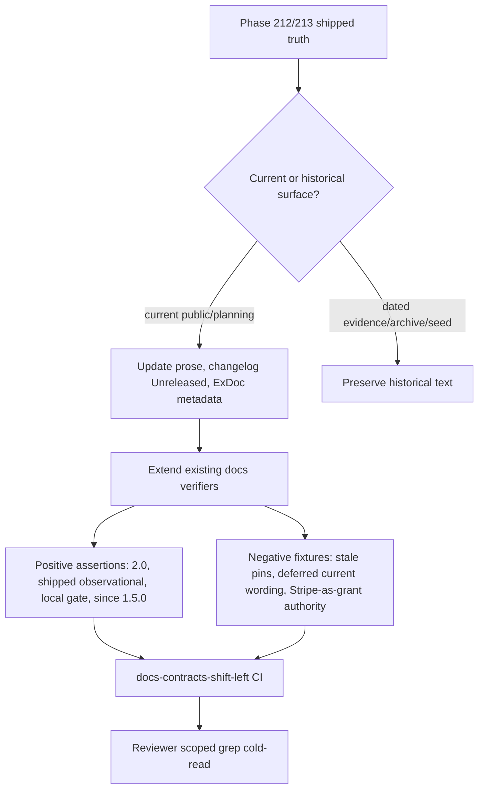

# Phase 214: Docs & truth reconciliation - Research

**Researched:** 2026-07-31
**Domain:** documentation truth reconciliation, ExDoc metadata, release-note drift contracts
**Confidence:** HIGH

<user_constraints>
## User Constraints (from CONTEXT.md)

### Locked Decisions

## Implementation Decisions

The user asked for all five gray areas to be researched by specialist subagents and
resolved as one coherent recommendation set. The decisions below incorporate Elixir,
ExDoc, Phoenix/Ecto/Plug, Hex and linked-release conventions; successful billing-library
patterns from Stripe, Pay, Cashier, and similar ecosystems; Accrue's local prompts and
latest brand DNA; developer ergonomics; auditability; and stable-core constraints.

### Canonical sync wording

- **D-01:** Use this semantic contract everywhere current behavior is explained:
  **Accrue's local plan→feature map is the canonical authorization gate.
  Stripe-native entitlement sync is optional, off by default, and writes a local
  advisory cache for diagnostics and admin read surfaces only. It never changes
  `entitled?/2`, `has_active_plan?/2`, controller plugs, or LiveView guards.**
  Individual documents may shorten the sentence for their audience, but they must keep
  all four facts: local gate authority, optional/default-off sync, advisory diagnostics,
  and grant invariance. — **Reversibility: one-way** — changing this after publication
  would reverse the v1.x authorization contract and the isolation guarantee on which
  adopter access decisions depend.
- **D-02:** Use drift/reconciliation language only as the secondary explanation of why
  the cache exists: it lets operators compare what Stripe last reported with Accrue's
  local access model. Never call the two layers dual authorities.
- **D-03:** Scope "source of truth" language explicitly. Stripe remains authoritative
  for Stripe-side payment and entitlement objects; the local plan→feature map remains
  authoritative for **Accrue grant decisions**. Unqualified claims that Stripe-native
  entitlements are Accrue's authorization source of truth are forbidden.
- **D-04:** Copy follows the current brand voice: measured, exact, native, durable,
  direct, calm, and practical. Lead with the useful authorization fact, use concrete
  nouns and strong verbs, define "advisory cache" once, and avoid implementation-detail
  dumps or hype.

### Release-note allocation and ownership

- **D-05:** `accrue/CHANGELOG.md` owns the substantive `## Unreleased` entry. It records
  the `lattice_stripe ~> 2.0` dependency bump, the optional advisory refresh path and
  supported public/test contracts, default-off and never-a-gate semantics, shared
  reconcile/isolation proof, and the closed `fetch_entitled/2` decision.
- **D-06:** `accrue_admin/CHANGELOG.md` and `accrue_portal/CHANGELOG.md` each receive a
  short `## Unreleased` linked-version compatibility note. They may say the package
  resolves with the coordinated core dependency/sync release, but must not claim a new
  admin/portal-owned workflow, API, or grant authority.
- **D-07:** `accrue/guides/release-notes.md` remains the hand-authored, plain-language
  cross-package story. Add a next-release story (target `1.5.0`) for core plus
  compatibility-only admin and portal coverage, and add the missing portal changelog
  link beside the core/admin links. Do not hand-edit generated
  `accrue/doc/release-notes.md`. The local generated file is ignored and untracked, so
  it is not a phase artifact and must not be added unless repository tracking policy
  changes. [VERIFIED: `git ls-files --error-unmatch`, `git check-ignore -v`]
- **D-08:** Do not add a numbered `1.5.0` changelog block or bump package versions on
  `main`. Release Please remains the single writer for numbered changelog sections and
  all linked package version bumps. `## Unreleased` is drained into the numbered section
  on the release PR per `RELEASING.md`.

### Public API version metadata

- **D-09:** All Phase 213 adopter-facing additions use `@doc since: "1.5.0"`.
  `accrue-v1.4.0` predates the Phase 213 feature commits, so the existing
  `StripeSync.refresh/2` value of `"1.4.0"` is incorrect and must be changed. The normal
  linked Release Please/semver path makes the next feature release `1.5.0`.
- **D-10:** Annotate exactly these supported contracts:
  `Accrue.Entitlements.StripeSync.refresh/2`;
  `Accrue.Processor.list_active_entitlements/2` at both rendered contract surfaces
  (metadata immediately before the `@callback` and separately before the public facade);
  and `Accrue.Processor.Fake.put_entitlements/2` as the deterministic adopter test
  helper.
- **D-11:** Keep adapter implementations, active-entitlement metadata helpers,
  `Accrue.Entitlements.Reconcile` writers, `StripeSync.summary_for_customer/1`, and the
  Oban worker callback hidden/internal and without `since` badges. Documentation is an
  API contract in Elixir; technical callability alone must not turn plumbing into a
  promised public surface.
- **D-12:** Do not mix `1.4.0` and `1.5.0` metadata across this feature family. If the
  release plan changes from the normal feature release, stop and reconcile every badge,
  changelog, release note, and package version together rather than silently shipping
  contradictory availability claims.

### Current truth versus historical evidence

- **D-13:** Apply a scoped current-truth sweep. Update public/current surfaces that
  answer "what is true now": `CLAUDE.md`, the JTBD guides, active support/adoption
  matrices, package changelogs and release notes, current code docs, and active planning
  status mirrors. In particular, active Phase 213 status must say the final
  re-verification passed; stale intermediate "gaps found" status is not current truth.
- **D-14:** Preserve dated evidence: completed phase plans, contexts, research,
  summaries, reviews, verifications, upgrade evidence, archived milestones,
  retrospectives, and the fired SEED-005 origin record. Old pins or "deferred" wording
  in those files describes what was true at that time and must not be rewritten into
  false history.
- **D-15:** Grep review and automated checks must classify paths before judging a hit.
  Current/public files must agree on `~> 2.0` and shipped/observational status; dated
  phase/archive/seed hits are allowed when explicitly historical. Do not use an
  unscoped repo-wide absence rule.

### Drift prevention

- **D-16:** Extend existing documentation contracts instead of creating a new truth
  verifier. `scripts/ci/verify_package_docs.sh` owns current stack/JTBD/entitlements
  assertions; `scripts/ci/verify_release_notes_contract.sh` owns the next-release story
  and three-package discoverability. Use existing CI wiring and ExUnit shell-out tests.
- **D-17:** Add high-signal positive and negative checks with actionable failure labels.
  Positives cover `~> 2.0`, shipped/observational status, the local canonical
  authorization gate, advisory diagnostics, default-off behavior, the three
  package/changelog paths, and `since: "1.5.0"` on the supported public contracts.
  Negatives reject stale `~> 0.2`/`~> 1.1` only in the current stack/version surfaces,
  current JTBD "sync deferred" claims, Stripe-as-Accrue-grant-authority wording, and
  claims that advisory sync changes a gate decision.
- **D-18:** Test the negative guards with focused ExUnit fixtures so each semantic
  regression demonstrably fails. Do not freeze full paragraphs, enforce one exact prose
  rendering across audience-specific docs, or duplicate the same contract across a new
  script.
- **D-19:** Keep the manual acceptance grep from the roadmap as a final cold-read, but
  make it scoped and explanatory: current surfaces must tell one story; historical
  matches must remain obviously dated rather than being counted as contradictions.

### the agent's Discretion

- Exact audience-appropriate shortening of D-01, provided all four semantic facts remain.
- Exact headings and bullet ordering inside each `## Unreleased` or next-release section.
- Whether existing verifier helpers are extended or one small shared helper is extracted,
  provided no new top-level verifier/CI lane is introduced.
- Exact fixture prose used to prove negative guards.

### Deferred Ideas (OUT OF SCOPE)

## Deferred Ideas

None — discussion stayed within phase scope.
</user_constraints>

<phase_requirements>
## Phase Requirements

| ID | Description | Research Support |
|----|-------------|------------------|
| DOCS-01 | `CLAUDE.md` Technology Stack and Version Compatibility Matrix must say `lattice_stripe ~> 2.0`, including the stale `~> 0.2` matrix cell. | Current grep found `CLAUDE.md` still has `~> 1.1` in the stack row and `~> 0.2` in the matrix, while `accrue/mix.exs` pins `{:lattice_stripe, "~> 2.0"}` and all four lockfiles resolve `2.1.0`. [VERIFIED: codebase grep] |
| DOCS-02 | `accrue/guides/jobs_to_be_done.md` and `.planning/research/JTBD-FRONTIER.md` must flip Phase 127 sync wording from deferred to shipped/observational without making it a gate. | Current grep found deferred/off-by-default wording in both JTBD surfaces; Phase 213 verification says the advisory sync passed 13/13 truths and never affects grants. [VERIFIED: codebase grep] |
| DOCS-03 | Changelogs/release notes, public `@doc since` metadata, adoption proof, support matrix, and planning mirrors must agree. | Existing changelogs lack `## Unreleased`; release notes still describe `1.4.0`; `StripeSync.refresh/2` is `since: "1.4.0"`; `Processor.list_active_entitlements/2` and `Fake.put_entitlements/2` need `since: "1.5.0"` metadata per locked decisions. [VERIFIED: codebase grep] |
</phase_requirements>

## Summary

Phase 214 is a documentation and contract-reconciliation phase, not a behavior phase. The implementation truth is already present: Phase 212 bumped `:lattice_stripe` to `~> 2.0` with all four lockfiles resolving `2.1.0`, and Phase 213 passed 13/13 verification truths for the opt-in advisory Stripe-native entitlement refresh. [VERIFIED: `.planning/phases/212.../212-UPGRADE-EVIDENCE.md`, `.planning/phases/213.../213-VERIFICATION.md`, codebase grep]

The planning risk is not library choice; it is scope classification. Current public/current surfaces must be corrected, while dated evidence files must remain historical. Existing docs gates pass today, which proves they do not yet enforce Phase 214's new truth contract. Extend `verify_package_docs.sh` and `verify_release_notes_contract.sh`; do not create a parallel verifier. [VERIFIED: local gate execution]

**Primary recommendation:** Use a three-slice plan: current doc truth sweep, public ExDoc/release metadata sweep, then existing verifier/test hardening with scoped positive and negative assertions. [VERIFIED: codebase grep]

## Architectural Responsibility Map

| Capability | Primary Tier | Secondary Tier | Rationale |
|------------|--------------|----------------|-----------|
| Current documentation truth | Documentation / planning artifacts | CI docs-contracts-shift-left | The phase changes Markdown and code docs; CI only prevents drift. [VERIFIED: `.github/workflows/ci.yml`] |
| ExDoc public API metadata | Core library source docs | ExDoc build | `@doc since:` lives next to supported public functions/callbacks and renders through ExDoc. [CITED: https://hexdocs.pm/elixir/writing-documentation.html] |
| Release/changelog truth | Package changelogs and hand-authored release notes | Release Please release PR | `## Unreleased` can be edited on main, but numbered sections and package versions are Release Please-owned. [VERIFIED: `RELEASING.md`, `release-please-config.json`; CITED: https://github.com/googleapis/release-please] |
| Drift prevention | Existing bash verifier scripts | ExUnit shell-out fixture tests | Existing scripts are already run in `docs-contracts-shift-left`; tests prove failure behavior. [VERIFIED: `.github/workflows/ci.yml`, `accrue/test/accrue/docs/*`] |

## Project Constraints (from CLAUDE.md)

- Use GSD workflow artifacts for doc updates; this phase is already inside GSD planning. [VERIFIED: `CLAUDE.md`]
- Tech baseline remains Elixir 1.19+, OTP 27+, Phoenix 1.8+, Ecto 3.12+, PostgreSQL 14+. [VERIFIED: `CLAUDE.md`]
- Required dependency story includes `lattice_stripe`; Phase 214 must reconcile the row to the already-shipped `~> 2.0` truth. [VERIFIED: `CLAUDE.md`, `accrue/mix.exs`]
- Security posture forbids weakening webhook signature verification or logging sensitive Stripe fields; Phase 214 should avoid adding examples that imply secrets, PII, or provider data belong in docs/tests. [VERIFIED: `CLAUDE.md`]
- No project-local skills were found in `.claude/skills/` or `.agents/skills/`. [VERIFIED: `rg --files`]

## Standard Stack

### Core

| Library / Tool | Version | Purpose | Why Standard |
|----------------|---------|---------|--------------|
| Elixir / Mix | Elixir 1.19.5, Mix 1.19.5 available locally | Run focused ExUnit docs tests and parse `@doc since` metadata behavior through compiler/docs conventions | Already the project runtime. [VERIFIED: local command] |
| Bash + ripgrep | Bash 5.2.37, ripgrep 15.2.0 available locally | Existing docs verifiers and scoped grep audits | Current scripts use bash and grep/rg-style assertions. [VERIFIED: local command, scripts] |
| ExUnit | Project configured | Shell-out fixture tests for docs verifier negative paths | Existing docs tests use ExUnit and `System.cmd/3`. [VERIFIED: `accrue/test/accrue/docs/*`] |
| Release Please | Configured by repo | Single writer for linked package versions and numbered changelogs | Official Release Please automates changelog generation, release PRs, GitHub releases, and version bumps. [CITED: https://github.com/googleapis/release-please] |

### Supporting

| Library / Tool | Version | Purpose | When to Use |
|----------------|---------|---------|-------------|
| ExDoc metadata | Project docs config | `@doc since: "1.5.0"` on supported public contracts | Use only on public adopter-facing functions/callbacks named in D-10. [CITED: https://hexdocs.pm/elixir/writing-documentation.html] |
| `scripts/ci/verify_package_docs.sh` | local script | Current stack/JTBD/entitlements assertions | Extend for DOCS-01, DOCS-02, ExDoc `since`, and canonical sync wording. [VERIFIED: codebase grep] |
| `scripts/ci/verify_release_notes_contract.sh` | local script | Plain-language release notes and three-package discoverability | Extend for target `1.5.0`, portal changelog link, and next-release story. [VERIFIED: codebase grep] |

### Alternatives Considered

| Instead of | Could Use | Tradeoff |
|------------|-----------|----------|
| Extending existing verifiers | New top-level truth verifier | Rejected by D-16; it fragments CI ownership and duplicates failure modes. [VERIFIED: CONTEXT.md] |
| Scoped current-truth grep | Repo-wide absence rule | Rejected by D-14/D-15 because historical phase evidence intentionally contains old pins and deferred wording. [VERIFIED: CONTEXT.md] |
| `## Unreleased` entries | Manual numbered `1.5.0` changelog block | Rejected by D-08 and `RELEASING.md`; Release Please owns numbered sections. [VERIFIED: CONTEXT.md, `RELEASING.md`] |

**Installation:** none. This phase installs no external packages. [VERIFIED: phase scope]

## Package Legitimacy Audit

No external package installs are recommended for this phase. [VERIFIED: phase scope]

## Architecture Patterns

### System Architecture Diagram



### Recommended Project Structure

```text
CLAUDE.md                                      # current stack/version truth
accrue/guides/jobs_to_be_done.md              # public JTBD truth
.planning/research/JTBD-FRONTIER.md           # active planning JTBD mirror
.planning/REQUIREMENTS.md                     # active requirement status mirror
.planning/STATE.md                            # active phase status mirror
.planning/ROADMAP.md                          # phase success/current status mirror
accrue/CHANGELOG.md                           # substantive Unreleased entry
accrue_admin/CHANGELOG.md                     # compatibility-only Unreleased entry
accrue_portal/CHANGELOG.md                    # compatibility-only Unreleased entry
accrue/guides/release-notes.md                # hand-authored next-release story
scripts/ci/verify_package_docs.sh             # stack/JTBD/entitlements/current docs gate
scripts/ci/verify_release_notes_contract.sh   # release notes gate
accrue/test/accrue/docs/*.exs                 # shell-out fixture red paths
```

### Pattern 1: Scoped Current-Truth Sweep

**What:** Classify every grep hit as current/public, active planning mirror, or dated evidence before editing. [VERIFIED: CONTEXT.md]

**When to use:** Use for `lattice_stripe`, `~> 0.2`, `~> 1.1`, `sync deferred`, `Phase 127`, `Gaps Found`, and `since: "1.4.0"`. [VERIFIED: codebase grep]

**Example:**

```bash
rg -n '~> 0\.2|~> 1\.1|sync stays deferred|Optional Stripe-native sync deferred|Gaps Found|since: "1\.4\.0"' \
  CLAUDE.md accrue/guides .planning/ROADMAP.md .planning/REQUIREMENTS.md \
  .planning/STATE.md .planning/research .planning/processor-support-matrix.md \
  examples/accrue_host/docs/adoption-proof-matrix.md accrue/lib/accrue scripts/ci
```

### Pattern 2: Positive and Negative Bash Contracts

**What:** Add a small set of `require_fixed`, `require_regex`, and `require_absent_regex` checks to existing scripts, then add ExUnit fixtures that mutate copied docs and assert non-zero exit with the relevant failure label. [VERIFIED: `verify_package_docs.sh`, docs tests]

**When to use:** Use for stale version pins, forbidden grant-authority wording, and release-note discoverability. [VERIFIED: CONTEXT.md]

**Example:**

```bash
require_fixed "$ROOT_DIR/CLAUDE.md" '| `:lattice_stripe` | `~> 2.0` |'
require_absent_regex "$ROOT_DIR/CLAUDE.md" 'lattice_stripe[^\n]*~> 0\.2|lattice_stripe[^\n]*~> 1\.1'
require_absent_regex "$ROOT_DIR/accrue/guides/jobs_to_be_done.md" 'sync (stays )?deferred|deferred/off-by-default'
```

### Pattern 3: ExDoc Metadata Beside the Public Contract

**What:** Put `@doc since: "1.5.0"` immediately before the public function/callback being documented. [CITED: https://hexdocs.pm/elixir/writing-documentation.html]

**When to use:** Only for D-10 public contracts; keep internal helpers hidden or unbadged per D-11. [VERIFIED: CONTEXT.md]

**Example:**

```elixir
@doc since: "1.5.0"
@callback list_active_entitlements(id(), opts()) :: {:ok, [map()]} | {:error, Exception.t()}

@doc """
Lists active entitlement payloads for an advisory refresh.
"""
@doc since: "1.5.0"
@spec list_active_entitlements(id(), opts()) :: {:ok, [map()]} | {:error, Exception.t()}
def list_active_entitlements(id, opts \\ [])
```

### Anti-Patterns to Avoid

- **Unscoped repo-wide cleanup:** Historical phase plans, research, verification, archived milestone docs, and SEED-005 preserve old truth and should not be rewritten. [VERIFIED: CONTEXT.md]
- **Manual `1.5.0` changelog sections on main:** Use `## Unreleased`; Release Please drains numbered sections on release PRs. [VERIFIED: `RELEASING.md`; CITED: https://github.com/googleapis/release-please]
- **Stripe as Accrue grant authority:** Public docs must keep Stripe authoritative for Stripe objects only, while Accrue grant decisions remain local-map authoritative. [VERIFIED: CONTEXT.md]
- **Freezing full prose paragraphs in CI:** Use semantic literals and targeted negatives; do not force every audience-specific doc to use identical paragraphs. [VERIFIED: CONTEXT.md]

## Don't Hand-Roll

| Problem | Don't Build | Use Instead | Why |
|---------|-------------|-------------|-----|
| Documentation drift gate | New standalone truth verifier | Extend `verify_package_docs.sh` / `verify_release_notes_contract.sh` | Existing CI owns these contracts and already has ExUnit shell-out tests. [VERIFIED: local scripts] |
| Release version/changelog bump | Manual version bump or numbered `1.5.0` block | Release Please release PR | Local runbook and official Release Please behavior make this automated. [VERIFIED: `RELEASING.md`; CITED: https://github.com/googleapis/release-please] |
| API docs version badges | Custom docs table | `@doc since:` metadata | Elixir documentation metadata supports `:since`. [CITED: https://hexdocs.pm/elixir/writing-documentation.html] |
| Grant/source-of-truth explanation | New entitlement authority model | D-01 four-fact wording | Prevents docs from implying dual authorities or Stripe-backed gates. [VERIFIED: CONTEXT.md] |

**Key insight:** The complex part is not editing prose; it is preserving the current/historical boundary while making CI fail on future current-surface drift. [VERIFIED: codebase grep]

## Runtime State Inventory

| Category | Items Found | Action Required |
|----------|-------------|-----------------|
| Stored data | None; this phase changes docs and source metadata only. Verified by phase scope and no runtime rename/migration requirement. [VERIFIED: CONTEXT.md] | None |
| Live service config | None; no external service configuration changes are in scope. [VERIFIED: CONTEXT.md] | None |
| OS-registered state | None; no OS registrations are referenced by the phase. [VERIFIED: CONTEXT.md] | None |
| Secrets/env vars | None; no env var rename or secret key change is in scope. [VERIFIED: CONTEXT.md] | None |
| Build artifacts | `accrue/doc/release-notes.md` exists locally as generated ExDoc output, is ignored by `**/doc/`, and is not tracked by Git; D-07 says do not hand-edit it. [VERIFIED: CONTEXT.md, `git ls-files --error-unmatch`, `git check-ignore -v`] | Do not edit or add it in this phase. A normal ExDoc build may refresh the ignored local copy, but it remains outside the tracked phase diff unless repository tracking policy changes. |

## Common Pitfalls

### Pitfall 1: Treating Historical Evidence as Drift

**What goes wrong:** A repo-wide grep finds old pins or deferral language in completed phase artifacts and the plan rewrites history. [VERIFIED: codebase grep]

**Why it happens:** The same terms appear in both current docs and dated evidence. [VERIFIED: codebase grep]

**How to avoid:** Classify paths first; only current/public surfaces and active mirrors are edited. [VERIFIED: CONTEXT.md]

**Warning signs:** A plan includes `.planning/phases/212-*`, `.planning/phases/213-*` plans/summaries/reviews, archived milestones, or seed files as edit targets. [VERIFIED: CONTEXT.md]

### Pitfall 2: Passing Current Gates Without Enforcing New Truth

**What goes wrong:** `verify_package_docs.sh`, `verify_release_notes_contract.sh`, `verify_processor_support_matrix.sh`, and `verify_entitlement_sync_isolation.sh` pass while stale Phase 214 docs remain. [VERIFIED: local gate execution]

**Why it happens:** Existing scripts predate the Phase 214 truth contract. [VERIFIED: local gate execution]

**How to avoid:** Extend existing scripts and add negative fixtures. [VERIFIED: CONTEXT.md]

**Warning signs:** The plan only edits Markdown and has no docs-test red paths. [VERIFIED: CONTEXT.md]

### Pitfall 3: Mixing `1.4.0` and `1.5.0`

**What goes wrong:** One public function gets a `1.5.0` badge while `StripeSync.refresh/2` still says `1.4.0`, or release notes describe the feature under `1.4.0`. [VERIFIED: codebase grep]

**Why it happens:** Package `@version` remains `1.4.0` on main, but Phase 213 is next-release work. [VERIFIED: `.release-please-manifest.json`, CONTEXT.md]

**How to avoid:** Use `@doc since: "1.5.0"` only on D-10 supported contracts, and use `## Unreleased` / next-release prose for changelog/release notes. [VERIFIED: CONTEXT.md]

**Warning signs:** A manual numbered `## [1.5.0]` block or package `@version "1.5.0"` appears outside a Release Please PR. [VERIFIED: `RELEASING.md`]

### Pitfall 4: Overstating Advisory Sync

**What goes wrong:** Docs say Stripe-native entitlements are Accrue's source of truth or change grant decisions. [VERIFIED: CONTEXT.md]

**Why it happens:** Stripe is authoritative for Stripe objects, but Accrue grants are intentionally local. [VERIFIED: CONTEXT.md]

**How to avoid:** Keep all four D-01 facts in every audience-specific rendering. [VERIFIED: CONTEXT.md]

**Warning signs:** Phrases like "Stripe-backed gate", "dual authorities", or "sync changes entitled?/2" appear in current docs. [VERIFIED: CONTEXT.md]

## Code Examples

### ExUnit Red-Path Fixture for Docs Drift

```elixir
test "package docs reject stale lattice_stripe matrix pin" do
  tmp_dir = tmp_dir!()
  seed_tmp_dir!(tmp_dir)

  claude_path = Path.join(tmp_dir, "CLAUDE.md")
  File.write!(claude_path, File.read!(claude_path) <> "\n| lattice_stripe ~> 0.2 | stale |\n")

  {output, status} = run_verifier(tmp_dir)

  assert status != 0
  assert output =~ "[verify_package_docs]"
  assert output =~ "lattice_stripe"
end
```

### Bash Guard for Release Notes Discoverability

```bash
grep -Fq '[`accrue_portal/CHANGELOG.md`](https://github.com/szTheory/accrue/blob/main/accrue_portal/CHANGELOG.md)' "$notes" ||
  fail "release-notes.md missing accrue_portal changelog link"

grep -Fq "### 1.5.0" "$notes" ||
  fail "release-notes.md must describe next release 1.5.0"
```

## State of the Art

| Old Approach | Current Approach | When Changed | Impact |
|--------------|------------------|--------------|--------|
| `lattice_stripe ~> 1.1` / stale `~> 0.2` planning matrix | `lattice_stripe ~> 2.0`, resolving `2.1.0` in lockfiles | Phase 212, 2026-07-30 | Current stack docs must say 2.x. [VERIFIED: upgrade evidence, lockfiles] |
| Phase 127 optional Stripe-native sync deferred | Phase 213 advisory refresh shipped, opt-in/default-off, never a gate | Phase 213 verified 2026-07-31 | JTBD/current docs must flip to shipped/observational. [VERIFIED: 213-VERIFICATION.md] |
| `StripeSync.refresh/2` `since: "1.4.0"` | D-10 requires `since: "1.5.0"` for Phase 213 public contracts | Phase 214 decision | Public API metadata must be reconciled as a family. [VERIFIED: codebase grep, CONTEXT.md] |

**Deprecated/outdated:**
- Current `CLAUDE.md` `lattice_stripe` row and matrix cells are outdated. [VERIFIED: codebase grep]
- Current JTBD deferral wording is outdated in public/current surfaces. [VERIFIED: codebase grep]
- `StripeSync.refresh/2` `since: "1.4.0"` is outdated for the Phase 213 feature family. [VERIFIED: codebase grep]

## Assumptions Log

All claims in this research are verified locally or cited from official documentation. No `[ASSUMED]` claims are required. [VERIFIED: research process]

## Open Questions (RESOLVED)

1. **Should generated `accrue/doc/release-notes.md` be regenerated as a tracked phase artifact? — No.**
   - Measured result: the file exists locally, `git ls-files --error-unmatch accrue/doc/release-notes.md` exits 1, and `git check-ignore -v accrue/doc/release-notes.md` identifies `.gitignore` rule `**/doc/`. It is generated, ignored, and untracked. [VERIFIED: local Git commands]
   - Resolution: do not hand-edit or add `accrue/doc/release-notes.md` in Phase 214. If a normal ExDoc build refreshes the local copy, it remains outside the tracked phase diff. Revisit only if repository tracking policy changes.

## Environment Availability

| Dependency | Required By | Available | Version | Fallback |
|------------|-------------|-----------|---------|----------|
| Elixir | ExUnit docs tests, optional docs build | yes | 1.19.5 / OTP 28 | none needed |
| Mix | test commands | yes | 1.19.5 | none needed |
| Bash | existing verifier scripts | yes | 5.2.37 | none needed |
| ripgrep | scoped audit / acceptance grep | yes | 15.2.0 | grep, but rg is available |
| Git | status and tracked generated-doc checks | yes | 2.41.0 | none needed |

**Missing dependencies with no fallback:** none. [VERIFIED: local command]

**Missing dependencies with fallback:** none. [VERIFIED: local command]

## Validation Architecture

### Test Framework

| Property | Value |
|----------|-------|
| Framework | ExUnit via Mix 1.19.5 [VERIFIED: local command] |
| Config file | `accrue/test/test_helper.exs` [VERIFIED: project structure] |
| Quick run command | `cd accrue && mix test test/accrue/docs/package_docs_verifier_test.exs test/accrue/docs/release_notes_contract_test.exs` |
| Full suite command | `bash scripts/ci/verify_package_docs.sh && bash scripts/ci/verify_release_notes_contract.sh && bash scripts/ci/verify_processor_support_matrix.sh && bash scripts/ci/verify_entitlement_sync_isolation.sh` |

### Phase Requirements → Test Map

| Req ID | Behavior | Test Type | Automated Command | File Exists? |
|--------|----------|-----------|-------------------|--------------|
| DOCS-01 | Current stack docs reject stale `lattice_stripe` pins and require `~> 2.0` | docs contract + fixture | `bash scripts/ci/verify_package_docs.sh`; `cd accrue && mix test test/accrue/docs/package_docs_verifier_test.exs` | yes, extend |
| DOCS-02 | JTBD surfaces say shipped/observational and never grant-authoritative | docs contract + fixture | `bash scripts/ci/verify_package_docs.sh`; `cd accrue && mix test test/accrue/docs/package_docs_verifier_test.exs` | yes, extend |
| DOCS-03 | Changelog/release notes/API metadata/support mirrors agree | docs contract + fixture | `bash scripts/ci/verify_release_notes_contract.sh`; `bash scripts/ci/verify_package_docs.sh`; docs tests | yes, extend |

### Sampling Rate

- **Per task commit:** relevant script plus focused docs ExUnit file.
- **Per wave merge:** full suite command above.
- **Phase gate:** docs-contracts-shift-left relevant scripts green, plus scoped acceptance grep classifying historical hits.

### Wave 0 Gaps

- [ ] Extend `accrue/test/accrue/docs/package_docs_verifier_test.exs` with stale `lattice_stripe` and deferred-sync red paths.
- [ ] Extend `accrue/test/accrue/docs/release_notes_contract_test.exs` with missing portal changelog link / missing next-release story red paths.
- [ ] Add verifier assertions for `since: "1.5.0"` on D-10 public contracts.

## Security Domain

### Applicable ASVS Categories

| ASVS Category | Applies | Standard Control |
|---------------|---------|------------------|
| V2 Authentication | no | No auth code changes. [VERIFIED: phase scope] |
| V3 Session Management | no | No session code changes. [VERIFIED: phase scope] |
| V4 Access Control | yes | Preserve local plan→feature map as the sole grant authority in docs. [VERIFIED: CONTEXT.md] |
| V5 Input Validation | yes | Bash verifier inputs are local files; keep scoped regexes narrow and quoted. [VERIFIED: existing scripts] |
| V6 Cryptography | no | No crypto changes; do not weaken webhook signature docs. [VERIFIED: CLAUDE.md] |

### Known Threat Patterns for docs/security posture

| Pattern | STRIDE | Standard Mitigation |
|---------|--------|---------------------|
| Docs imply Stripe advisory sync controls authorization | Elevation of privilege / information disclosure | D-01/D-03 wording plus negative docs guards. [VERIFIED: CONTEXT.md] |
| Docs expose secrets or live customer data in examples | Information disclosure | Keep examples deterministic/Fake and avoid secrets/PII. [VERIFIED: CLAUDE.md] |
| Regex verifier overmatches historical files | Tampering with audit history | Scope verifier paths to current surfaces only. [VERIFIED: CONTEXT.md] |

## Sources

### Primary (HIGH confidence)

- `214-CONTEXT.md` - locked D-01..D-19 decisions and phase boundaries.
- `.planning/REQUIREMENTS.md` - DOCS-01, DOCS-02, DOCS-03.
- `.planning/phases/212.../212-UPGRADE-EVIDENCE.md` - `lattice_stripe ~> 2.0` and lockfile resolved version evidence.
- `.planning/phases/213.../213-VERIFICATION.md` - final 13/13 verification truth.
- Local code grep across `CLAUDE.md`, JTBD docs, changelogs, source docs, verifier scripts, and docs tests.
- Local gate execution: `verify_package_docs.sh`, `verify_release_notes_contract.sh`, `verify_processor_support_matrix.sh`, `verify_entitlement_sync_isolation.sh`.

### Secondary (MEDIUM confidence)

- https://hexdocs.pm/elixir/writing-documentation.html - official Elixir documentation metadata guidance for `:since`.
- https://github.com/googleapis/release-please - official Release Please behavior summary.

### Tertiary (LOW confidence)

- None.

## Metadata

**Confidence breakdown:**
- Standard stack: HIGH - local tools and scripts verified.
- Architecture: HIGH - phase is local docs/CI only and ownership is explicit in context and CI.
- Pitfalls: HIGH - each drift category was observed through grep or locked in decisions.

**Research date:** 2026-07-31
**Valid until:** 2026-08-07 for current branch state; re-run grep after any Phase 213/Release Please changes.
