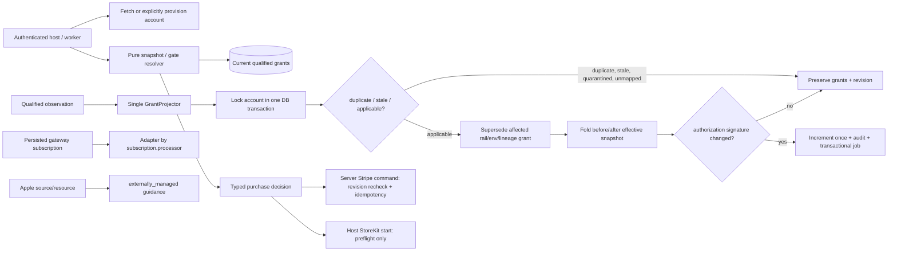

# Phase 217: Canonical projection and compatibility - Research

**Researched:** 2026-08-02
**Domain:** Revisioned, account-scoped entitlement projection; multi-rail compatibility; persisted-resource billing dispatch
**Confidence:** HIGH

<user_constraints>
## User Constraints (from CONTEXT.md)

### Locked Decisions

#### Revisioned Account Snapshot
- **D-01:** Add a read-only, rail-neutral account snapshot as the canonical multi-rail decision object. Its semantic fields are an opaque account ID, monotonic revision, deduplicated logical plans, unioned features, maximum effective quantity per quota, and privacy-safe source summaries containing rail, environment, normalized state/effective bounds, and redacted correlation only. Public collections must be deterministic. — **Reversibility:** costly — hosts, later offline proofs, purchase decisions, diagnostics, and fixtures will depend on this value contract.
- **D-02:** Snapshot reads are pure: they never provision an account, call a provider, reconcile evidence, or write state. They accept an entitlement account or host-authenticated billable reference; explicit account provisioning remains a separate authenticated operation. Existing boolean/scalar gates keep their return shapes.
- **D-03:** One projector is the sole writer of effective grants and account revisions. In one database transaction it locks the account, rejects duplicate/stale/out-of-order evidence, writes or supersedes only the affected rail/environment/lineage grants, compares the effective before/after snapshot, increments revision at most once, records the audit event, and arranges transactional follow-up work.
- **D-04:** Revision advances only when the effective authorization signature changes: plans, features, quantities, or known effective/revocation/expiry bounds. Metadata enrichment, diagnostics, duplicates, quarantined or unmapped evidence, and other no-op observations do not advance revision. A source retraction cannot remove equivalent access still supplied by another live source. — **Reversibility:** costly — monotonic clients, offline proof issuance, audit interpretation, and repair logic will rely on this meaning of revision.
- **D-05:** Grants and immutable observations remain the durable truth. Do not introduce a separately authoritative denormalized snapshot reducer or reconstruct authorization by replaying provider delivery order. A cache may be considered later only after measured need and must never become a second decision system. Stripe `Billing.EntitlementSummary` remains advisory-only and cannot seed accounts, grants, revisions, snapshots, eligibility, or gates.

#### Cross-Rail Purchase Eligibility
- **D-06:** Expose a typed, rail-neutral purchase decision with closed statuses `eligible`, `block`, and `warn`; stable reason codes; target rail and logical plan; source summary; and the snapshot revision used. Do not reduce this boundary to a boolean. — **Reversibility:** costly — host purchase flows, support guidance, telemetry, and cross-language fixtures will pattern-match this vocabulary.
- **D-07:** Equivalent means exactly that a live effective grant on a different rail maps through the qualified catalog to the same logical plan. Never infer equivalence from bare provider IDs, feature overlap, price, quantity, gateway customer rows, email, or device identity.
- **D-08:** An equivalent second-rail purchase blocks by default. Missing, stale, repairing, or ambiguous canonical state also blocks with an actionable reason instead of failing open. First-purchase flows explicitly provision/fetch the authenticated entitlement account before eligibility evaluation.
- **D-09:** Override is an explicit, revision-bound host action that records a bounded reason, privacy-safe actor reference, target rail/plan, equivalent source set, decision revision, and outcome. The purchase path must recheck current revision and equivalence before continuing; a changed revision is re-evaluated rather than trusted. Override changes the decision to an explicit warning and never cancels, transfers, refunds, migrates, merges, or prorates another rail.
- **D-10:** Server-controlled Stripe purchase commands use a durable intent/operation identifier for provider idempotency and reconcile ambiguous provider outcomes before retrying. Apple uses the same preflight before the host starts StoreKit, but a concurrent Apple completion is observed as a diagnostic conflict rather than treated as authority for cross-rail mutation. Phase 217 does not add a reservation subsystem.

#### Legacy Backfill, Shadow, and Cutover
- **D-11:** Lock an explicit three-state compatibility contract: `disabled` keeps the existing `LocalMap` lane authoritative; `shadow` backfills and compares canonical results without changing gates; `enabled` makes canonical snapshots authoritative only for approved accounts or host-defined cohorts. Omitting multi-rail configuration preserves legacy behavior. — **Reversibility:** costly — configuration, deployment choreography, tests, and adopter runbooks will depend on these mode semantics.
- **D-12:** Backfill creates one stable entitlement account per billable identity and derives only mapped, entitling Stripe subscription state into grants. It is deterministic, chunked, resumable, and idempotent by account/current-grant identity; it never rewrites subscriptions, customers, provider resources, or advisory summaries.
- **D-13:** Parity compares normalized entitlement meaning rather than internal representation. Enablement requires a defined clean shadow window, no unresolved unmapped products or projection ambiguity, and passing resource-scoping/advisory-isolation proofs. Mismatches have stable, privacy-safe reason IDs and remain visible blockers rather than silently falling back.
- **D-14:** Rollback changes only gate authority back to `LocalMap`. It preserves accounts, grants, observations, revisions, and ongoing repair; it never deletes canonical evidence or mutates gateway subscriptions. Reject per-request automatic fallback because authorization authority must be deterministic and projection defects must remain visible.

#### Provider-Honest Lifecycle Dispatch
- **D-15:** Persisted resource provenance is the authority for gateway lifecycle actions. Existing `Accrue.Billing` cancellation, period-end cancellation, resume, pause/unpause, swap, quantity/item, preview, and bang facades retain their signatures for `%Billing.Subscription{}` and resolve the gateway adapter from the resource's persisted processor. They never use current global processor configuration or a caller-supplied rail for an existing resource. — **Reversibility:** costly — every gateway mutation path and compatibility test must share this dispatch invariant.
- **D-16:** The configured default processor/rail remains valid for legacy resource creation and deterministic `customer/1`; it is not authority for an already-persisted resource. Resource lookup and host authorization occur before adapter resolution, and ambiguous/unscoped provider identifiers fail closed.
- **D-17:** Apple grants never become Stripe-shaped billing subscriptions and never enter gateway mutation functions. Add one rail-neutral management/capability query over a persisted resource. Apple management returns a successful, actionable `externally_managed` outcome with stable guidance key, exact text, literal action label, and Apple management URL. Do not provide a bang mutation that converts this guidance into an exception.
- **D-18:** Unknown resources/rails, unavailable capabilities, wrong resource types, and authorization failures return typed errors with stable codes and next actions. Externally managed remains distinct from unavailable, deferred, host-owned, and feasibility-blocked. Negative tests must prove Apple paths cannot reach cancellation, retry, swap, proration, refund, invoice, payment-method, or dunning adapters.
- **D-19:** Gateway mutations retain existing idempotency, transaction, audit, error, and bang/non-bang conventions. Snapshot, projector, eligibility, cutover, and lifecycle telemetry use bounded fields such as revision, action, rail/environment, disposition, reason, cohort/mode, and internal or hashed identifiers; they never contain email, raw receipts/JWS, Apple account tokens, provider payloads, or adopter identity.

#### Host and User Experience
- **D-20:** This phase adds no UI, but its values must support consumer/JTBD-first rendering. Hosts see logical plans, access decisions, responsible rail, exact reason, and next safe action—not reducer, observation, cursor, or provider-transport internals.
- **D-21:** Use the current brandbook voice for guidance and errors: measured, exact, Elixir/Phoenix-native, and durable. Outcomes are text-backed rather than color-only. A later UI must use conventional accessible controls, literal link/action labels, keyboard/focus correctness, reduced-motion and light/dark/system compatibility, and no destructive affordance for externally managed resources.
- **D-22:** Preferred Apple warning copy is: “This account already has Pro through Apple. Continuing creates another subscription.” Preferred management guidance is: “Manage this subscription in Apple.” with action label “Manage subscription.” Exact plan/source substitutions may be generated from bounded public labels.

### the agent's Discretion

The planner may choose exact module, function, struct, transaction-helper, outbox, task, telemetry-event, and typed-error names; whether deterministic snapshot collections use sorted lists or another serialization-safe representation; how host cohorts are expressed; backfill chunk size and retry cadence; and whether the management query is named `management/2`, `lifecycle_outcome/2`, or an equivalent idiomatic context function. Those choices must preserve the locked semantics, closed outcomes/reasons, legacy signatures, transaction and provenance boundaries, and negative cross-rail isolation proofs above.

### Deferred Ideas (OUT OF SCOPE)

Apple evidence verification, StoreKit restore or reconciliation, offline proof issuance, Crosswake runtime integration, adopter-facing admin/portal UI, automatic rail migration, refund/transfer/proration policy, and Google Play.
</user_constraints>

<phase_requirements>
## Phase Requirements

| ID | Description | Research Support |
|---|---|---|
| ACCT-01 | Union effective plans/features; deduplicate logical grants; maximum quantity. | Pure live-grant snapshot fold and semantic authorization signature. |
| ACCT-02 | Source-local revoke/refund/expiry; no revision for duplicate/metadata-only evidence. | Account-row-locked projector, lineage-scoped supersession, before/after signature comparison. |
| ACCT-03 | Persisted-rail lifecycle dispatch and externally managed guidance. | Adapter registry keyed by persisted subscription processor plus source capability outcome. |
| ACCT-04 | Preserve legacy hosts through idempotent backfill, parity, and opt-in cutover. | `disabled`/`shadow`/`enabled` resolver authority and deterministic backfill design. |
| ACCT-05 | Preflight second-rail purchase blocking and explicit warning override. | Closed typed decision, catalog-qualified equivalence, revision-bound recheck and audit. |
</phase_requirements>

## Summary

Implement Phase 217 as one additive canonical-decision lane beside the legacy `LocalMap` lane. The snapshot is a pure fold over the current Phase-216 grants; grants and observations stay authoritative. The projector is the only mutation boundary: lock one entitlement account, classify observation ordering, supersede only the applicable rail/environment/lineage rows, fold before and after, then increment the revision and append the audit event only for a material authorization difference. [VERIFIED: repository inspection]

Use the existing compatibility seam instead of changing public gate shapes. `disabled` continues to resolve through `LocalMap`; `shadow` computes and compares canonical meaning while preserving `LocalMap` gate authority; `enabled` uses canonical resolution only for a configured account/cohort. Backfill and rollback change decision authority, never gateway resources or retained canonical data. [VERIFIED: repository inspection]

**Primary recommendation:** Build four bounded internal slices in order—pure snapshot/signature, transactional projector, typed purchase/cutover service, and persisted-resource lifecycle registry—then prove their integration with deterministic property and negative-isolation tests.

## Architectural Responsibility Map

| Capability | Primary Tier | Secondary Tier | Rationale |
|---|---|---|---|
| Effective-grant projection and revision | Database / Storage | API / Backend | PostgreSQL account lock and transaction serialize authority changes. |
| Pure account snapshot and gate resolution | API / Backend | Database / Storage | Context reads durable current grants; it performs no provider operation or write. |
| Cross-rail purchase preflight/override | API / Backend | Database / Storage | Host UI consumes a typed result; server rechecks revision/equivalence before a Stripe command. |
| Gateway lifecycle dispatch | API / Backend | Database / Storage | Persisted subscription processor chooses the adapter after resource/authorization lookup. |
| Backfill/shadow/cutover | API / Backend | Database / Storage | A resumable task/services derive canonical grants but do not alter provider data. |
| External Apple management presentation | Browser / Client | API / Backend | Core returns text-backed actionable outcome; a later host UI renders it. |

## Project Constraints (from AGENTS.md)

No `AGENTS.md` was present. The applicable project directives from `CLAUDE.md` are:

- Use Elixir 1.19+, OTP 27+, Ecto 3.12+, and PostgreSQL 14+; this checkout is Elixir 1.19.5 / OTP 28 / PostgreSQL client 14.17. [VERIFIED: repository inspection]
- Preserve the monorepo boundary; hosts own Repo, Oban, authentication, memberships, runtime resources, and provider credentials. `Accrue.Application` remains childless. [VERIFIED: repository inspection]
- Webhook signature verification is mandatory; raw sensitive Stripe fields and payment-method PII must never be logged or retained as diagnostic data. [VERIFIED: CLAUDE.md]
- Public entry points emit telemetry start/stop/exception events; preserve the existing audit and telemetry conventions. [VERIFIED: repository inspection]
- Keep Phoenix LiveView runtime out of always-compiled core code and out of `extra_applications`. [VERIFIED: CLAUDE.md]

## Standard Stack

### Core

| Library | Version | Purpose | Why Standard |
|---|---:|---|---|
| Existing `:ecto` | 3.13.6 locked | Transactional reads/writes, changesets, query locking. | Existing host-Repo abstraction and schemas already use it. [VERIFIED: repository inspection] |
| Existing `:ecto_sql` / `:postgrex` | 3.13.5 / 0.22.2 locked | PostgreSQL constraints, partial indexes, row locks. | Database is the project’s concurrency authority. [VERIFIED: repository inspection] |
| Existing `:oban` | 2.23.0 locked | Transactionally enqueued follow-up/backfill/retry work. | Existing project pattern for durable async work. [VERIFIED: repository inspection] |

### Supporting

| Library | Version | Purpose | When to Use |
|---|---:|---|---|
| Existing `Accrue.Events` | internal | Immutable audit event in the same transaction. | Each material projector/override/cutover action. [VERIFIED: repository inspection] |
| Existing `Accrue.Telemetry` / `Telemetry.Ops` | internal | Bounded public and ops telemetry. | Snapshot/projector/eligibility/lifecycle boundaries. [VERIFIED: repository inspection] |
| Existing `Accrue.Entitlements.Source.Registry` | internal | Closed capability vocabulary and Apple management guidance. | Management/capability outcomes; do not recreate its state model. [VERIFIED: repository inspection] |

### Alternatives Considered

| Instead of | Could Use | Tradeoff |
|---|---|---|
| Live-grant fold | Materialized snapshot table/reducer | Rejected: creates a second authoritative decision system and violates D-05. |
| Account row lock + transaction | Application-only mutex/optimistic retry | Rejected: does not make Postgres the concurrency authority and risks duplicate revision/event outcomes. |
| Persisted adapter lookup | `Processor.__impl__/0` for existing resources | Rejected: global default is not resource provenance and causes cross-processor dispatch. |

**Installation:** none. This phase adds no external dependencies; retain the locked project dependencies.

## Architecture Patterns

### System Architecture Diagram



### Recommended Project Structure

```text
accrue/lib/accrue/
├── entitlements/
│   ├── snapshot.ex              # pure, deterministic live-grant fold/value
│   ├── projector.ex             # sole grant/revision writer
│   ├── purchase_decision.ex     # closed preflight + override contract
│   ├── compatibility.ex         # disabled/shadow/enabled and parity result
│   └── resolver/canonical.ex    # opt-in Resolver implementation
├── rails/
│   └── gateway_registry.ex      # persisted processor -> gateway adapter
└── billing/subscription_actions.ex # route existing lifecycle calls through registry
```

### Pattern 1: Semantic snapshot signature

**What:** Fold only current, effective, mapped grants into canonical sorted plans/features/source summaries and quota maxima. Derive a comparison signature from authorization fields only; exclude observations, metadata, diagnostic correlations, and incidental row IDs.

**When to use:** Before and after every applicable projector write, and for read-only snapshot/eligibility evaluation.

```elixir
# Source: repository pattern + [CITED: https://ecto.hexdocs.pm/Ecto.Repo.html]
before = Snapshot.from_current_grants(account, grants)
updated = GrantMutation.apply(grants, observation)
after_snapshot = Snapshot.from_current_grants(account, updated)

if Snapshot.authorization_signature(before) == Snapshot.authorization_signature(after_snapshot) do
  {:ok, %{snapshot: after_snapshot, revision_changed?: false}}
else
  {:ok, Account.bump_revision(account) |> repo.update!()}
end
```

### Pattern 2: Serialized account projector

**What:** Use `Accrue.Repo.transact/1`; select the account `FOR UPDATE`; classify ordering against only the affected qualified lineage; update/supersede grants; compare signatures; write audit and durable follow-up in the same transaction.

**When to use:** Every grant-producing or retracting observation. Never let another module directly write current grants or `Account.revision`.

`Ecto.Multi` can compose named dynamic operations, while a normal `Repo.transact` callback is simpler for ordered projector control flow. Both execute atomically; `Ecto.Multi.run/3` receives the transactional Repo and prior changes. [CITED: https://ecto.hexdocs.pm/Ecto.Multi.html]

### Pattern 3: Compatibility authority switch, not fallback

**What:** Select exactly one resolver authority per request/account: LocalMap (`disabled`), LocalMap plus canonical comparison (`shadow`), or canonical (`enabled` and cohort approved). Persist/report mismatch blockers; never silently retry the other authority during a request.

**When to use:** Configuration/Resolver routing and deployment runbook only. It must not alter existing `entitled?/2`, `has_active_plan?/2`, `features_for/1`, or `entitlement_quantity/2` result shapes.

### Pattern 4: Persisted-provenance gateway dispatch

**What:** Resolve an existing `%Billing.Subscription{processor: ...}` to a controllable adapter only after fetching/scoping/authorizing the resource. Use current default processor only for new resource creation and legacy `customer/1`.

**When to use:** Cancel, period-end cancellation, resume, pause/unpause, swap, quantity/item updates, and invoice preview; extend the audit to linked gateway resource mutations in scope.

### Anti-Patterns to Avoid

- **Snapshot persistence as authority:** do not store/reduce a second authorization truth; cache only after measurement and invalidate from the sole projector.
- **Replay-order authorization:** do not reconstruct access by provider delivery order; use current grants and provider ordering only to decide whether a lineage mutation applies.
- **Broad revocation:** a source change may only supersede its exact rail/environment/lineage grant(s); the subsequent aggregate fold preserves survivors.
- **Global dispatch:** never call `Processor.__impl__/0` for an existing resource. Repository inspection shows it remains at multiple `SubscriptionActions` mutation sites. [VERIFIED: repository inspection]
- **Implicit enablement/fallback:** omitted configuration remains legacy; shadow mismatch remains a visible blocker.
- **Boolean purchase decision:** hosts need a closed status, reason, revision, target and actionable sources; a boolean cannot carry safe override semantics.

## Don't Hand-Roll

| Problem | Don't Build | Use Instead | Why |
|---|---|---|
| Transaction grouping | Custom transaction orchestration | Existing `Accrue.Repo.transact/1` / `Ecto.Multi` | Existing project and Ecto provide rollback semantics and test seams. [CITED: https://ecto.hexdocs.pm/Ecto.Multi.html] |
| Concurrency authority | In-memory account mutex | PostgreSQL row lock plus partial unique constraints | Works across host processes/nodes and matches project policy. [VERIFIED: repository inspection] |
| Audit history | Ad-hoc projector event table | `Accrue.Events` | Immutable ledger with existing idempotency support. [VERIFIED: repository inspection] |
| Capability/guidance state | New Apple lifecycle enum | `Entitlements.Source.Registry` / `Outcome` | Existing closed states distinguish externally managed from unavailable/deferred/host-owned. [VERIFIED: repository inspection] |
| Provider retry identity | Random retry token | Existing `Processor.Idempotency` durable operation key pattern | Ambiguous Stripe outcomes require reconciliation before a new attempt. [VERIFIED: repository inspection] |

**Key insight:** The difficult domain logic is not aggregation arithmetic; it is maintaining one serialized authorization truth while keeping legacy gateway objects and their default-processor semantics untouched.

## Common Pitfalls

### Pitfall 1: Revision records deliveries rather than authorization
**What goes wrong:** Duplicate, stale, metadata-only, unmapped, or quarantined observations increment revision, invalidating clients for no authorization change.
**How to avoid:** Compare a deterministic authorization signature containing only plans, features, max quantities, and known effective/revocation/expiry bounds before/after an applicable write; update revision at most once in that transaction. [VERIFIED: repository inspection]

### Pitfall 2: A revocation destroys survivor access
**What goes wrong:** A Stripe retraction removes an Apple grant for the same logical plan.
**How to avoid:** Scope mutation to rail/environment/lineage and refold all current grants after the local change. Dedupe plan presence, union features, and take max quota quantity. [VERIFIED: repository inspection]

### Pitfall 3: Global processor dispatch mutates the wrong provider
**What goes wrong:** Changing configuration changes how an old subscription is cancelled or updated.
**How to avoid:** Resolve adapter from `subscription.processor`; gate every non-gateway/unknown type before calling an adapter. Add negative tests proving Apple never reaches cancel/retry/swap/proration/refund/invoice/payment-method/dunning. [VERIFIED: repository inspection]

### Pitfall 4: Cutover quietly fails open
**What goes wrong:** Shadow mismatch falls back to LocalMap per request or enabled mode accepts incomplete/unmapped state.
**How to avoid:** Make mode/cohort authority deterministic, require clean shadow window and no blockers for enablement, retain mismatch reason IDs, and roll back only the authority selection. [VERIFIED: repository inspection]

### Pitfall 5: Preflight race creates duplicate charge
**What goes wrong:** A host trusts an old `eligible` result after state changes or retries a Stripe command after ambiguous provider completion.
**How to avoid:** Persist override audit facts, re-read snapshot revision/equivalence immediately before the controllable command, use a durable idempotency key, and reconcile ambiguous Stripe outcome before retry. Apple conflict is observed diagnostically, not cross-rail authority. [CITED: https://docs.stripe.com/api/idempotent_requests]

### Pitfall 6: Privacy leakage through supporting data
**What goes wrong:** Snapshot, telemetry, override or audit data stores email, raw JWS/receipt, Apple token, provider payload, or adopter identity.
**How to avoid:** Keep only opaque account/internal-or-hashed IDs, redacted correlations, rail/environment, bounded state, revision, reason and action. [VERIFIED: repository inspection]

## Code Examples

### Deterministic effective snapshot fold

```elixir
# Source: repository LocalMap max/union precedent
def from_current_grants(account, grants) do
  grants
  |> Enum.filter(&effective?/1)
  |> Enum.reduce(seed(account), &merge_grant/2)
  |> then(&%{&1 | plans: Enum.sort(&1.plans), features: Enum.sort(&1.features),
                  sources: Enum.sort_by(&1.sources, &source_sort_key/1)})
end

defp merge_grant(grant, snapshot) do
  snapshot
  |> put_plan_once(grant.logical_plan)
  |> union_plan_features(grant.logical_plan)
  |> merge_quota_max(grant.logical_plan, grant.quantity)
  |> append_redacted_source(grant)
end
```

### Row-locked projector shape

```elixir
# Source: [CITED: https://ecto.hexdocs.pm/Ecto.Repo.html]
Repo.transact(fn ->
  account = repo.one!(from(a in Account, where: a.id == ^account_id, lock: "FOR UPDATE"))
  current = Grant.current_for_lineage(repo, account.id, rail, environment, lineage)
  before = Snapshot.from_current_grants(account, Grant.current_for_account(repo, account.id))

  with {:apply, mutation} <- Ordering.classify(observation, current),
       {:ok, _} <- GrantMutation.apply(repo, mutation),
       after_snapshot <- Snapshot.for_account(repo, account),
       {:ok, result} <- Revision.record_if_material(repo, account, before, after_snapshot) do
    result
  else
    {:noop, reason} -> %{revision_changed?: false, reason: reason}
    {:error, reason} -> repo.rollback(reason)
  end
end)
```

### Revision-bound purchase override

```elixir
# Source: phase locked contract D-09
with %PurchaseDecision{status: :block, revision: revision} = decision <- preflight(account, rail, plan),
     :ok <- validate_bounded_override(reason, actor),
     {:ok, current} <- Snapshot.fetch(account),
     true <- current.revision == revision or {:error, :decision_stale},
     {:warn, override} <- record_and_recheck_override(current, decision, reason, actor) do
  {:ok, override}
end
```

## State of the Art

| Old Approach | Current Approach | When Changed | Impact |
|---|---|---|---|
| Global configured processor resolves lifecycle | Persisted resource provenance resolves existing lifecycle; default only creates/looks up legacy default resources | Phase 217 | Prevents wrong-rail mutation. [VERIFIED: repository inspection] |
| `LocalMap` only resolves entitlement gates | Opt-in canonical resolver with shadow parity and deterministic cohort cutover | Phase 217 | Maintains legacy shapes while enabling account-wide access. [VERIFIED: repository inspection] |
| Provider event delivery is an implicit change counter | Effective authorization signature drives revision | Phase 217 | Stable validator for later clients/offline proofs. [VERIFIED: repository inspection] |

## Assumptions Log

| # | Claim | Resolution | Evidence / executable consequence |
|---|---|---|---|
| A1 | The planned lifecycle registry can cover all Phase-217 in-scope gateway mutation facades without a public signature change. | **RESOLVED** | The in-scope persisted-resource boundary is the public `%Billing.Subscription{}` / linked `%Billing.SubscriptionItem{}` facade set enumerated below. Plan 217-05 inventories and guards every member while explicitly keeping creation and other persisted resource types outside this phase. |
| A2 | A transactional Oban insert is sufficient for the required follow-up handoff under the host’s existing Oban configuration. | **RESOLVED** | The repository already inserts Oban jobs inside `Accrue.Repo.transact/1` (`Accrue.Webhooks.DLQ.commit_requeue/1`), and tests start host-owned Oban against `Accrue.TestRepo`. Plan 217-01 uses a unique account/revision/action job inserted before commit, with abort, duplicate, retry, and stale-revision tests. No new outbox table is required. |

## Resolved Questions

1. **RESOLVED — backwards-compatible resolver configuration and cohort selector**
   - Contract: `config :accrue, :entitlements, multi_rail: [mode: :disabled | :shadow | :enabled, cohort: {:accounts, [account_id]} | {module, function, extra_args}, clean_window: [started_at: DateTime.t(), ended_at: DateTime.t(), comparison_count: pos_integer()]]`.
   - Omission of `:multi_rail` is exactly `:disabled` and retains the existing `resolver:`/`LocalMap` lane. `:shadow` and `:enabled` require an explicit cohort. The MFA is invoked as `apply(module, function, [account | extra_args])`; non-boolean, exception, or ambiguous results exclude the account and fail closed. Account lists are deduplicated/sorted opaque IDs.
   - A clean window is the exact half-open interval `[started_at, ended_at)` with `started_at < ended_at`, at least one comparison, zero mismatch/unmapped/projection/resource-isolation blockers, and evidence bound to the selected cohort plus current catalog/config digest. There is no duration, sampling, rounding, or permissive default to invent; absent or stale evidence blocks enablement.
   - Plan 217-04 validates this shape at boot and tests omitted/disabled/shadow/enabled, immediately included/excluded cohorts, exact start/end boundaries, zero/one comparison, stale digest, and MFA failure.
2. **RESOLVED — complete Phase-217 lifecycle mutation audit boundary**
   - In scope: `Billing.swap_plan/3` and bang, `cancel/2` and bang, `cancel_at_period_end/2` and bang, `resume/2` and bang, `pause/2` and bang, `unpause/2` and bang, `update_quantity/3` and bang, the `%Billing.Subscription{}` clause of `preview_upcoming_invoice/2` and bang, `add_item/3` and bang, `remove_item/2` and bang, and `update_item_quantity/3` and bang. Item operations must load/scope their parent subscription before registry resolution.
   - Creation (`subscribe` and deterministic `customer/1`) remains on the configured default per D-16. Schedules, invoices, charges/refunds, payment methods, coupons, meters, and dunning are distinct persisted resource types and are outside the D-15 signature-preservation boundary; Plan 217-05 records them in the inventory and statically fails if a new resource type is silently added to the in-scope allowlist. D-18 separately proves that Apple management cannot reach any of those adapter families.
   - Plan 217-05 owns a table-driven facade inventory plus runtime Fake assertions for every in-scope non-bang/bang pair and every explicitly excluded resource family.

## Environment Availability

| Dependency | Required By | Available | Version | Fallback |
|---|---|---|---|---|
| Elixir / Mix | Compile and test | ✓ | Elixir 1.19.5 / OTP 28 | — |
| PostgreSQL client | Ecto/Postgres integration tests | ✓ | 14.17 | Existing test Repo/Sandbox for normal suite |
| Existing Ecto/Oban deps | projector, audit, async follow-up | ✓ | locked in `mix.lock` | — |

**Missing dependencies with no fallback:** none.

## Validation Architecture

### Test Framework

| Property | Value |
|---|---|
| Framework | ExUnit (existing project) |
| Config file | `accrue/test/test_helper.exs` |
| Quick run command | `cd accrue && mix test test/accrue/entitlements --exclude live_stripe` |
| Full suite command | `cd accrue && mix test.all` |

### Phase Requirements → Test Map

| Req ID | Behavior | Test Type | Automated Command | File Exists? |
|---|---|---|---|---|
| ACCT-01 | union/dedupe/max deterministic snapshot | unit + property | `mix test test/accrue/entitlements/snapshot_test.exs test/property/entitlement_projection_property_test.exs` | ❌ Wave 0 |
| ACCT-02 | local retraction, ordering/no-op revision, concurrency | integration + property | `mix test test/accrue/entitlements/projector_test.exs test/property/entitlement_projection_property_test.exs` | ❌ Wave 0 |
| ACCT-03 | persisted adapter and Apple isolation | unit + static/integration | `mix test test/accrue/billing/resource_dispatch_test.exs` | ❌ Wave 0 |
| ACCT-04 | disabled/shadow/enabled parity/backfill/rollback | integration | `mix test test/accrue/entitlements/compatibility_test.exs` | ❌ Wave 0 |
| ACCT-05 | typed decision, stale override, default block | unit + integration | `mix test test/accrue/entitlements/purchase_decision_test.exs` | ❌ Wave 0 |

### Sampling Rate

- **Per task commit:** focused ExUnit file(s) plus `mix format --check-formatted`.
- **Per wave merge:** `cd accrue && mix test test/accrue/entitlements --exclude live_stripe`.
- **Phase gate:** `cd accrue && mix test.all` green.

### Wave 0 Gaps

- [ ] `test/accrue/entitlements/snapshot_test.exs` and `test/property/entitlement_projection_property_test.exs` — ACCT-01/02 semantic invariants.
- [ ] `test/accrue/entitlements/projector_test.exs` — row-lock/order/revision/audit proof.
- [ ] `test/accrue/entitlements/compatibility_test.exs` and `purchase_decision_test.exs` — ACCT-04/05 contract.
- [ ] `test/accrue/billing/resource_dispatch_test.exs` — ACCT-03 persisted-processor and negative Apple isolation.

## Security Domain

### Applicable ASVS Categories

| ASVS Category | Applies | Standard Control |
|---|---|---|
| V2 Authentication | yes | Host-authenticated billable/account references; no owner-ID lookup API. |
| V3 Session Management | no | Host-owned; no session mechanism is added. |
| V4 Access Control | yes | Fetch/authorize resource before adapter resolution; fail closed for unknown/unscoped resource. |
| V5 Input Validation | yes | Closed rail/environment/status/reason vocabulary and bounded override fields. |
| V6 Cryptography | no | No new cryptography; raw Apple signed evidence remains Phase 218 scope. |

### Known Threat Patterns for this stack

| Pattern | STRIDE | Standard Mitigation |
|---|---|---|
| Cross-account/resource mutation | Elevation of privilege | Authorize before persisted adapter lookup; never accept caller rail for existing resource. |
| Duplicate/stale observation revision churn | Tampering | Account row lock, qualified ordering, idempotency constraints, semantic before/after signature. |
| Cross-rail cancellation/refund | Tampering | Explicit gateway/externally-managed type boundary and negative adapter-reachability tests. |
| PII/raw-evidence diagnostics leak | Information disclosure | Redacted correlations, bounded telemetry/audit metadata; raw evidence excluded. |
| Ambiguous purchase retry | Repudiation / financial integrity | Durable operation ID, provider idempotency, current revision recheck, audit outcome. |

## Sources

### Primary (HIGH confidence)

- Repository: `accrue/lib/accrue/entitlements/{account,grant,observation,resolver/local_map,source/registry}.ex` — Phase-216 data model, legacy resolver, capability guidance, and existing union/max precedent. [VERIFIED: repository inspection]
- Repository: `accrue/lib/accrue/{repo,events}.ex`, `billing/{subscription,subscription_actions}.ex` — transaction/audit conventions and global-dispatch remediation surface. [VERIFIED: repository inspection]
- `.planning/phases/217-canonical-projection-and-compatibility/217-CONTEXT.md` — locked authority, compatibility, eligibility and lifecycle semantics. [VERIFIED: repository inspection]
- `.planning/research/v1.59-{ARCHITECTURE,DECISION-TABLE,PITFALLS}.md` — project-approved architecture/risk synthesis. [VERIFIED: repository inspection]

### Secondary (MEDIUM confidence)

- [Ecto.Multi documentation](https://ecto.hexdocs.pm/Ecto.Multi.html) — atomic named operations and `run/3` callback semantics. [CITED: https://ecto.hexdocs.pm/Ecto.Multi.html]
- [Ecto.Repo documentation](https://ecto.hexdocs.pm/Ecto.Repo.html) — `transact/2` transaction API. [CITED: https://ecto.hexdocs.pm/Ecto.Repo.html]
- [Stripe idempotent requests](https://docs.stripe.com/api/idempotent_requests) — idempotency/reconciliation constraint for server Stripe commands. [CITED: https://docs.stripe.com/api/idempotent_requests]

### Tertiary (LOW confidence)

- None; no unverified package or external implementation recommendation is required for this phase.

## Metadata

**Confidence breakdown:**
- Standard stack: HIGH — all required components are already locked and used in this repository.
- Architecture: HIGH — Phase context locks the critical semantics and Phase 216 provides the persistence seams.
- Pitfalls: HIGH — derived from the approved risk bundle plus direct global-dispatch inventory.

**Research date:** 2026-08-02
**Valid until:** 2026-09-01 (project-internal architecture; recheck Ecto/Stripe documentation before any dependency or API change)
