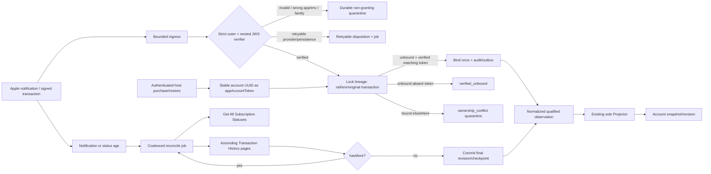

# Phase 218: Apple observation and repair - Research

**Researched:** 2026-08-03
**Domain:** App Store Server API / Notifications V2 verification, account-lineage linking, and convergent reconciliation
**Confidence:** MEDIUM

<user_constraints>
## User Constraints (from CONTEXT.md)

### Locked Decisions

#### Lineage Linking and Repair
- **D-01:** Add a durable Apple lineage-claim boundary ahead of account-scoped observations. Its authority key is `{rail: :apple, environment, original_transaction_id}` and it carries an optional immutable account binding, binding/repair state, privacy-bounded verified-token correlation, and ordering high-water data. Do not force verified-but-unbound evidence into an arbitrary account merely because the existing `Observation` requires `account_id`. — **Reversibility:** costly — ownership constraints, repair APIs, observation admission, fixtures, and later diagnostics will depend on this identity boundary.
- **D-02:** A verified `appAccountToken` equal to the authenticated entitlement-account UUID may atomically claim an unbound lineage once. The transaction locks the lineage, rechecks ownership, binds it, inserts the qualified account observation idempotently, projects it through the existing projector, and records audit/outbox work. PostgreSQL uniqueness and locking are the concurrency authority; an Elixir check followed by an insert is insufficient.
- **D-03:** Missing or unusable verified tokens produce a non-granting `verified_unbound` outcome. A lineage already bound to another account produces a privacy-safe `ownership_conflict` quarantine. Neither path may fall back to email, device, product, receipt order, delivery order, client claims, or the restoring session as ownership evidence. Never disclose the owning account and never automatically transfer, merge, refund, cancel, migrate, or prorate.
- **D-04:** Explicit repair is available only for a verified, currently unbound lineage. Accrue owns the transactional bind, re-verification/refetch, bounded reason, actor audit, and idempotent reconciliation mechanism; the host supplies authenticated authorization policy. Apple `Set App Account Token`, if used, is a follow-up provider repair operation rather than ownership authority. A bound conflict remains quarantined for a future separately approved transfer policy.

#### Verification, Quarantine, and Evidence Retention
- **D-05:** Hide Apple crypto and provider-library details behind a narrow verifier behaviour with deterministic Fake and strict production adapters. First evaluate `app_store_server_library ~> 2.2` behind that boundary against Apple/captured fixtures, hostile-chain tests, API-shape checks, independent verification, supervision, privacy, and dependency gates. Admit it as a private adapter only if every gate passes; otherwise use a narrow Accrue-owned Finch plus JOSE/`:public_key` adapter. Dependency structs and JOSE details are never public API.
- **D-06:** Verification is non-bypassable and allowlist-based: require `ES256`; validate every outer and nested JWS independently; validate the ordered `x5c` chain to configured Apple roots, certificate time and purpose, signature, bundle ID, expected environment, and production `appAppleId`; reject unexpected critical/header behavior. Apple App Store credentials and trust configuration remain separate from Accrue offline-proof signing keys.
- **D-07:** Use four semantic disposition classes across ingest and repair: fully verified evidence may be normalized and projected; duplicate or stale verified evidence is a successful no-op; provider/network/rate-limit/online-check or temporarily unavailable repair failures are retryable; malformed, cryptographically invalid, wrong-app, wrong-environment, unsupported-family, unmapped, and ownership-conflicting evidence is non-granting quarantine. Exact public reason atoms are closed and stable, with a bounded `next_action`; terminal evidence is never retried blindly, and retry exhaustion becomes durable `needs_repair` rather than disappearing in Oban.
- **D-08:** Preserve only normalized facts, evidence digest, bounded correlation, verifier/config version, disposition/reason, attempts, and timestamps in queryable storage. Raw JWS, receipts, tokens, notification bodies, adopter identity, and PII never enter rows, metadata, logs, telemetry, exceptions, Oban args, or UI. Optional replay material lives behind the existing opaque encrypted evidence reference with a purpose-specific expiry and deletion contract.
- **D-09:** The notification endpoint acknowledges only after a bounded result is durably recorded. A terminal verification failure may be acknowledged after bounded quarantine to prevent a provider retry storm; transient persistence/provider failures remain unsuccessful so Apple can retry. Enforce request-size and rate limits so malformed internet traffic cannot turn quarantine into unbounded storage.

#### Notification, Status, and History Convergence
- **D-10:** Use a hybrid convergence model. A verified App Store Server Notification V2 is an idempotent durable wakeup, not current entitlement truth. `Get All Subscription Statuses` is the present-state authority for auto-renewable subscriptions; ascending `Get Transaction History` supplies ordered history, revocation/refund/product-transition evidence, and repair. `Get Notification History` diagnoses delivery gaps and seeds bounded outage recovery, but never grants or retracts directly. — **Reversibility:** costly — repair checkpoints, worker semantics, fixtures, and support explanations will rely on this division of authority.
- **D-11:** Persist a reconciliation checkpoint per rail/environment/lineage with the initial query fingerprint, opaque revision, run state, page count/budget, attempts, last success, and next due time. Reuse identical filters on every page, upsert each verified transaction idempotently because an updated transaction may reappear, and commit the final revision only after an ascending scan reaches `hasMore: false`. A crash or 429/5xx before completion resumes without advancing the durable cursor.
- **D-12:** Notification receipt, authenticated purchase/restore completion, stale reconciliation age, near access bounds, retryable quarantine, cursor corruption, and notification-outage recovery all coalesce a lineage reconciliation job. Host-owned Oban supplies scheduled work, bounded concurrency, jittered exponential backoff, `Retry-After` handling, and per-app rate budgets. Oban uniqueness reduces duplicate insertion but is not a concurrency lock; database identities and projector/account locking remain correctness authority.
- **D-13:** During an Apple outage, retain only the last verified effective grant and never extend it beyond its known provider bound. Invalid or ambiguous evidence never widens access. Authentication/configuration failures alert and require repair rather than consuming retry attempts forever.

#### Apple Lifecycle Normalization
- **D-14:** Normalize Apple lifecycle into rail-neutral source facts and effective bounds; do not widen `Billing.Subscription` or Stripe enums. Active grants through verified expiry. Billing grace grants only through the verified `gracePeriodExpiresDate`. Billing retry does not invent access after the last valid provider bound. Expiry, refund, and revocation retract only the affected Apple source at their verified bounds; renewal disabled preserves access until the actual bound; authoritative refund-reversal/current evidence may restore the Apple source.
- **D-15:** The existing `Projector` remains the sole writer of grants and account revisions. It receives only account-bound, fully verified, normalized observations and must compare a complete monotonic Apple ordering tuple within rail/environment/lineage/product so delayed positive evidence cannot overwrite a later revocation, refund, or product transition. Apple evidence never enters gateway subscription reducers.
- **D-16:** Apple remains externally managed. Reuse the existing source-capability result and exact guidance: “Manage this subscription in Apple.” with action label “Manage subscription.” Negative tests must prove Apple observation, repair, reconciliation, and management paths cannot reach Stripe cancellation, retry, swap, proration, refund, invoice, payment-method, or dunning code.

#### Host API, DX, and Human-Facing Outcomes
- **D-17:** Expose Apple work through a small Phoenix-style `Accrue.Entitlements` context surface: purchase context/token retrieval, signed-evidence observation, lineage repair, and explicit reconciliation. Return tagged results with typed value objects containing stable disposition, bounded reason, next action, and snapshot/revision only when applicable. Do not expose Ecto lineage rows, Apple transaction IDs, cursors, raw payloads, provider-library values, or bang APIs for externally managed/repair outcomes. — **Reversibility:** costly — host integrations, support tooling, docs, and fixtures will pattern-match these result semantics.
- **D-18:** Consumer and operator language describes the job, result, and next safe action rather than backend machinery. Customer conflict copy is: “We couldn’t link this Apple purchase to this account. Contact support to review the purchase.” It must not reveal that another account owns the lineage. Operator outcomes distinguish “verified but no account token,” “ownership conflict,” “verification failed,” “Apple unavailable,” and “reconciliation stalled,” with literal actions such as “Retry reconciliation” or “Review ownership.”
- **D-19:** Emit allowlisted telemetry for verifier/config version, disposition/reason, rail/environment, lineage state, projection result/revision delta, reconciliation lag/pages/retries, queue age, and provider response class. Use internal or hashed correlations only. Diagnostics answer: what was verified, whether it is linked, whether access changed, whether repair is pending, and the next safe action.
- **D-20:** Merge-block with Apple and independent golden fixtures for wrong algorithm/root/certificate purpose/time/bundle/environment/app ID, nested-JWS failure, unbound and conflicting claim races, duplicate/out-of-order evidence, delayed positive after refund/revocation, grace/retry/expiry/refund/revocation bounds, 20+ history pages, changed filters, crash-before-cursor-commit, 429/5xx/outage, sandbox/production isolation, raw-data redaction, and zero Apple-to-Stripe lifecycle calls. Provider/sandbox fidelity complements but does not replace deterministic Fake-first proof.

### the agent's Discretion
The planner may choose exact module, struct, context-function, worker, telemetry-event, table, constraint, and reason-atom names; the bounded reconciliation cadence/backoff/page budget; and evidence-reference expiry by purpose. It may admit the community Apple server library only after the locked adapter gates pass. These choices must preserve the bind-once ownership boundary, closed outcome semantics, strict verification, final-page cursor commit, host-owned runtime resources, public API insulation, and provider-isolation proofs above.

### Deferred Ideas (OUT OF SCOPE)
- Automatic Apple ownership transfer, merge, or reassignment — future policy phase only after explicit product/security/finance approval.
- Family Sharing ownership semantics — deferred by POL-01.
- Introductory, promotional, and offer-eligibility authoring — deferred by POL-02.
- Adopter-facing admin/portal implementation and full repair runbooks — Phase 220 consumes the typed values defined here.
- Offline proof issuance and Crosswake runtime integration — Phase 219.
</user_constraints>

<phase_requirements>
## Phase Requirements

| ID | Description | Research Support |
|---|---|---|
| AAPL-01 | Opaque UUID purchase/restore, bind eligible verified lineage once, fail-closed conflicts. | `appAccountToken`-only claim transaction plus lineage table before account-required observations. |
| AAPL-02 | Strict notification and nested evidence verification. | Allowlisted ES256, x5c/trust/time/purpose/application identity verifier boundary. |
| AAPL-03 | Idempotent duplicate/order convergence and repairable quarantine. | Database lineage identity/high-water, closed dispositions, projector-only admission, retry checkpoint. |
| AAPL-04 | Scheduled current-status/history repair and correct normalized bounds. | Status authority, ascending history revision scan, durable final-page cursor, source-local retraction. |
| AAPL-05 | Honest Apple management and explicit deferrals. | Existing `Source.Registry` guidance plus gateway-isolation guards. |
</phase_requirements>

## Summary

Implement the Apple rail as a three-stage pipeline: strict verifier → unbound-or-bound lineage/reconciliation service → existing account observation/projector. The first two stages may durably record a bounded disposition, but neither may write a grant. Only a fully verified, account-bound normalized observation crosses into `Accrue.Entitlements.Projector`, which already locks the account and is the sole writer of grants and revisions. [VERIFIED: repository inspection]

Apple treats `appAccountToken` as a UUID associated with a purchase and returns it in transaction information; it also offers a server endpoint that can set or replace the token. Use the verified token only to claim an unbound lineage exactly once. Do not make the replace-capable Apple endpoint an ownership-transfer mechanism. [CITED: https://developer.apple.com/documentation/appstoreserverapi/appaccounttoken] [CITED: https://developer.apple.com/documentation/appstoreserverapi/set-app-account-token]

Notifications are signals, not entitlement truth. For auto-renewables, reconcile current status with `Get All Subscription Statuses`; use ascending Transaction History V2 for complete, idempotently upserted evidence and commit the server revision only after the final page. Notification History helps recover delivery gaps but its records may not be current state. [CITED: https://developer.apple.com/documentation/appstoreserverapi/get-all-subscription-statuses] [CITED: https://developer.apple.com/documentation/appstoreserverapi/get-transaction-history] [CITED: https://developer.apple.com/documentation/appstoreserverapi/notificationhistoryresponse]

**Primary recommendation:** Plan bounded vertical slices in this order: schema + closed values; Fake-first verifier/adapters; serialized lineage claim and observation admission; notification ingress/quarantine; reconciliation worker/checkpoint; then public context, telemetry, and exhaustive failure/isolation tests.

## Architectural Responsibility Map

| Capability | Primary Tier | Secondary Tier | Rationale |
|---|---|---|---|
| Signed payload verification and request admission | API / Backend | CDN / Static | The endpoint verifies opaque internet input before durable disposition. |
| Lineage bind-once ownership | Database / Storage | API / Backend | PostgreSQL uniqueness and row locking serialize claims; the context supplies authenticated policy. |
| Observation projection and account revision | Database / Storage | API / Backend | Existing projector owns transactional grant/revision mutation. [VERIFIED: repository inspection] |
| Apple status/history reconciliation | API / Backend | Database / Storage | Worker fetches provider data while checkpoint rows provide durable convergence. |
| Subscription-management guidance | API / Backend | Browser / Client | Core returns the existing actionable external-management result; host renders it. [VERIFIED: repository inspection] |

## Project Constraints (from AGENTS.md)

No `AGENTS.md` exists. Applicable directives from `CLAUDE.md` and existing architecture are:

- Use Elixir 1.19+, OTP 27+, Phoenix 1.8+, Ecto/PostgreSQL; keep the sibling-project monorepo boundary. [VERIFIED: CLAUDE.md]
- Hosts own Repo, Oban supervision/scheduling, Finch, credentials, authentication/authorization, and rendering. `Accrue.Application` remains childless. [VERIFIED: CLAUDE.md] [VERIFIED: repository inspection]
- Public entry points emit telemetry; do not log sensitive provider fields or PII. [VERIFIED: CLAUDE.md]
- Keep LiveView runtime out of always-compiled core and out of `extra_applications`. [VERIFIED: CLAUDE.md]
- Preserve Apple as an observer/external-management rail; it must not enter Stripe gateway lifecycle code. [VERIFIED: repository inspection]

## Standard Stack

### Core

| Library | Version | Purpose | Why Standard |
|---|---:|---|---|
| Existing `:ecto` / `:ecto_sql` / `:postgrex` | 3.13.6 / 3.13.5 / 0.22.2 locked | Migrations, constraints, transactions, row locks. | Existing entitlement schemas and projector establish PostgreSQL as concurrency authority. [VERIFIED: repository inspection] |
| Existing `:oban` | 2.23.0 locked | Coalesced reconcile/retry work. | Existing projector uses an Oban follow-up worker; uniqueness is enqueue dedup, not locking. [VERIFIED: repository inspection] |
| Existing `:finch` | 0.22.0 locked | Fallback Apple API HTTP transport owned by host supervision. | Already transitively available and must remain host-supervised. [VERIFIED: repository inspection] |
| `app_store_server_library` | 2.2.0, released 2026-02-01 | Candidate private Apple verifier/client adapter. | Evaluate only behind the locked behaviour and corpus gates; its low adoption prohibits treating it as domain authority. [ASSUMED] |

### Supporting

| Library | Version | Purpose | When to Use |
|---|---:|---|---|
| Existing `stream_data` | 1.3.0 locked | Permutation/concurrency properties. | Prove duplicate, out-of-order, and no-grant quarantine invariants. [VERIFIED: repository inspection] |
| Existing `Accrue.Entitlements.Projector` | internal | Sole grant and revision writer. | Invoke only after fully verified, account-bound normalization. [VERIFIED: repository inspection] |
| Existing `Accrue.Entitlements.Source.Registry` | internal | Apple externally-managed result. | Reuse exact Apple management guidance rather than model a subscription mutation. [VERIFIED: repository inspection] |

### Alternatives Considered

| Instead of | Could Use | Tradeoff |
|---|---|---|
| Private gated community adapter | Accrue-owned Finch + JOSE/`:public_key` adapter | Required fallback if conformance, supervision, or privacy gates fail; never relax x5c/application validation. [ASSUMED] |
| Lineage claim before observation | Nullable `Observation.account_id` | Rejected: it weakens the existing account-required observation and risks forcing unbound evidence into an account. [VERIFIED: repository inspection] |
| Current-status + history convergence | Notification-order reducer | Rejected: Apple says notification history can reflect stale purchase state and history can re-deliver updated transactions. [CITED: https://developer.apple.com/documentation/appstoreserverapi/notificationhistoryresponse] [CITED: https://developer.apple.com/documentation/appstoreserverapi/get-transaction-history] |

**Installation:** Do not install a package in the first implementation plan. Start with an adapter-admission spike/corpus; install the candidate only after its human verification and locked gates pass.

## Package Legitimacy Audit

| Package | Registry | Age | Downloads | Source Repo | Verdict | Disposition |
|---|---|---|---|---|---|---|
| `app_store_server_library` [ASSUMED] | Hex | Released 2026-02-01 | 94 / 7 days | github.com/yaglo/app-store-server-library-elixir | SUS (low adoption; Hex is outside the seam’s supported legitimacy ecosystems) | Flagged — planner must add `checkpoint:human-verify` before installation. |

**Packages removed due to [SLOP] verdict:** none.

**Packages flagged as suspicious [SUS]:** `app_store_server_library`; registry verification via `mix hex.info` confirmed version 2.2.0, release date, downloads, and repository, but this does not establish dependency suitability. [VERIFIED: Hex registry]

## Architecture Patterns

### System Architecture Diagram



### Recommended Project Structure

```text
accrue/lib/accrue/entitlements/
├── apple/
│   ├── verifier.ex                 # behaviour, strict adapter, deterministic fake
│   ├── client.ex                   # status/history/token client behaviour
│   ├── lineage.ex                  # bind-once schema and transactional claim
│   ├── intake.ex                   # closed disposition/quarantine admission
│   ├── reconciliation.ex           # checkpoint state machine and normalizer
│   └── reconcile_worker.ex         # host-owned Oban job
├── observation.ex                  # remains account-required
├── projector.ex                    # remains sole grant/revision writer
└── source/registry.ex              # reuse Apple external-management outcome
```

### Pattern 1: Lineage-first serialized admission

**What:** Insert-or-lock the rail/environment/original-transaction lineage, re-read its binding under lock, and only then bind or produce a closed non-granting result. Run observation insertion, projector call, audit, and outbox within the same transaction as the successful claim. [VERIFIED: repository inspection]

**When to use:** Authenticated purchase completion, restore, verified notification, and explicit repair.

```elixir
# Source: repository transaction/lock idiom
Accrue.Repo.transact(fn repo ->
  lineage = Lineage.lock_or_insert!(repo, :apple, environment, original_transaction_id)

  case Lineage.claim(lineage, authenticated_account.id, verified.app_account_token) do
    :claimable ->
      Lineage.bind!(repo, lineage, authenticated_account.id)
      {:ok, observation} = Intake.insert_qualified!(repo, verified, authenticated_account)
      Projector.project(observation, repo: repo)

    :verified_unbound -> {:ok, Outcome.verified_unbound()}
    :ownership_conflict -> {:ok, Outcome.quarantined(:ownership_conflict)}
  end
end)
```

### Pattern 2: Final-page reconciliation checkpoint

**What:** Persist the immutable initial filter fingerprint and the most recently received opaque revision; keep pages transactional and idempotent, but advance the durable completed cursor only after the response with `hasMore: false`. Apple requires the same query parameters for every paged Transaction History request and can repeat an updated transaction during an ascending scan. [CITED: https://developer.apple.com/documentation/appstoreserverapi/get-transaction-history]

**When to use:** Any coalesced notification/purchase/repair reconciliation.

```elixir
# Source: Apple Transaction History pagination contract
with {:ok, page} <- client.history(any_transaction_id, fingerprint, checkpoint.pending_revision),
     :ok <- Intake.upsert_verified_page(page.signed_transactions) do
  if page.has_more do
    Checkpoint.save_pending!(page.revision, fingerprint)
    {:snooze, 0}
  else
    Checkpoint.commit_complete!(page.revision, fingerprint)
    :ok
  end
end
```

### Anti-Patterns to Avoid

- **Decode then trust:** Base64URL-decoding a JWS proves neither provenance nor application identity; require signature, trust-chain, certificate and claim checks before normalization. [CITED: https://developer.apple.com/documentation/appstoreserverapi]
- **Client/session/email ownership inference:** Any fallback can bind a valid purchase to the wrong account; accept only the verified UUID token for an unbound lineage. [CITED: https://developer.apple.com/documentation/appstoreserverapi/appaccounttoken]
- **Notification reducer as current truth:** Delivery is asynchronous and notification history may be stale; repair through authoritative status/history. [CITED: https://developer.apple.com/documentation/appstoreservernotifications/responding-to-app-store-server-notifications] [CITED: https://developer.apple.com/documentation/appstoreserverapi/notificationhistoryresponse]
- **Cursor commit per page:** A crash before the final page otherwise silently drops later evidence. [CITED: https://developer.apple.com/documentation/appstoreserverapi/get-transaction-history]
- **Apple-shaped gateway subscriptions:** This would violate existing source isolation and can leak into Stripe lifecycle methods. [VERIFIED: repository inspection]

## Don't Hand-Roll

| Problem | Don’t Build | Use Instead | Why |
|---|---|---|---|
| Ownership serialization | Elixir-only “check then insert” | PostgreSQL unique identity plus `FOR UPDATE` transaction | Concurrent restore/notification deliveries need database authority. [VERIFIED: repository inspection] |
| Current auto-renewable state | Notification-order state machine | `Get All Subscription Statuses` during reconciliation | Apple documents this endpoint as status for all auto-renewable subscriptions. [CITED: https://developer.apple.com/documentation/appstoreserverapi/get-all-subscription-statuses] |
| Missed-delivery repair | Blind notification replay | Notification History to seed status/history reconciliation | Notification history is delivery diagnostic material, not current truth. [CITED: https://developer.apple.com/documentation/appstoreserverapi/notificationhistoryresponse] |
| Apple lifecycle control | Stripe cancellation/retry/swap adapter calls | Existing `externally_managed` source outcome | Apple management must stay provider-honest. [VERIFIED: repository inspection] |
| Public Apple transport model | Exposed provider structs/JWS | Small typed Accrue outcomes | Keeps a dependency replacement from becoming a breaking public API. [ASSUMED] |

**Key insight:** Apple cryptography and delivery are admission concerns; entitlement authority begins only at verified, bound normalized observations and remains centralized in the current projector.

## Common Pitfalls

### Pitfall 1: Treating `Set App Account Token` as ownership authority

**What goes wrong:** The endpoint can replace an existing token, turning a repair call into an implicit account transfer.

**Why it happens:** Apple permits token updates for existing transactions, while Accrue’s ownership rule is intentionally stricter.

**How to avoid:** Allow only local binding of a currently unbound, reverified lineage; a bound conflict remains quarantined regardless of a requested token update.

**Warning signs:** A code path calls Set App Account Token before checking local lineage binding. [CITED: https://developer.apple.com/documentation/appstoreserverapi/set-app-account-token]

### Pitfall 2: Losing transaction-history progress

**What goes wrong:** Advance a cursor after each page or change filters between pages, then miss records after a crash or receive invalid-revision failures.

**Why it happens:** History V2 uses opaque revision pagination and requires the same filters after the initial request.

**How to avoid:** Store query fingerprint + pending revision; commit only after `hasMore: false`; idempotently upsert each signed transaction.

**Warning signs:** Checkpoint has no filter fingerprint or marks a scan complete before the final page. [CITED: https://developer.apple.com/documentation/appstoreserverapi/get-transaction-history]

### Pitfall 3: Letting retry exhaustion disappear

**What goes wrong:** Oban eventually discards an unavailable Apple job and the account has no repair visibility.

**Why it happens:** Job retry state is not a durable domain disposition.

**How to avoid:** Persist retryable quarantine/attempts and transition exhaustion to `needs_repair`; schedule due checkpoint work separately.

**Warning signs:** Only Oban’s attempt count identifies a stalled lineage. [VERIFIED: repository inspection]

### Pitfall 4: Cross-environment identity collision

**What goes wrong:** Sandbox/test evidence changes production access, or production-only `appAppleId` validation rejects all sandbox input.

**Why it happens:** Apple’s notification `appAppleId` is not present in sandbox while `environment` is a distinct payload property.

**How to avoid:** Namespace all lineage/checkpoint/provider identities by environment; require configured production app ID only in production.

**Warning signs:** Any lineage unique index omits environment. [CITED: https://developer.apple.com/documentation/appstoreservernotifications/data]

## Code Examples

### Safe notification acknowledgement boundary

```elixir
# Source: Apple retry/recovery guidance + project quarantine convention
case Apple.Intake.record_signed_notification(body, context) do
  {:ok, %{disposition: disposition}} when disposition in [:verified, :noop, :quarantined] ->
    send_resp(conn, 200, "")

  {:error, :retryable} ->
    send_resp(conn, 503, "")
end
```

Apple notes that retry notifications are available only in production; sandbox attempts delivery once, so scheduled reconciliation is mandatory in both environments. [CITED: https://developer.apple.com/documentation/appstoreservernotifications/responding-to-app-store-server-notifications]

### Source-local bound normalization

```elixir
# Source: locked Phase 218 lifecycle contract
def effective_bound(%{state: :active, expires_at: expires_at}), do: expires_at
def effective_bound(%{state: :grace, grace_expires_at: bound}), do: bound
def effective_bound(%{state: state}) when state in [:billing_retry, :expired, :refunded, :revoked], do: nil
```

The normalizer supplies a qualified observation; it never calls `Accrue.Billing` or directly writes grants. [VERIFIED: repository inspection]

## State of the Art

| Old Approach | Current Approach | When Changed | Impact |
|---|---|---|---|
| Transaction History V1 | Transaction History V2 | V1 is deprecated in Apple API documentation. | Use V2 revision pagination and signed transaction records. [CITED: https://developer.apple.com/documentation/appstoreserverapi] |
| V1 notifications | App Store Server Notifications V2 | V2 is the signed-notification path used by this phase. | Ingest the `signedPayload`; do not design a legacy JSON trust path. [CITED: https://developer.apple.com/documentation/appstoreservernotifications] |
| Notification delivery as reconciliation | Status/history API convergence | Current Apple docs distinguish current status from notification-history delivery records. | Treat notifications as durable wakeups only. [CITED: https://developer.apple.com/documentation/appstoreserverapi/notificationhistoryresponse] |

**Deprecated/outdated:** `Get Transaction History V1` is deprecated; use V2. [CITED: https://developer.apple.com/documentation/appstoreserverapi]

## Assumptions Log

| # | Claim | Section | Risk if Wrong |
|---|---|---|---|
| A1 | `app_store_server_library` can satisfy the private verifier/client adapter gates. | Standard Stack | A production dependency could be unsafe, poorly supervised, or API-incompatible; retain the fallback and human gate. |
| A2 | A Finch + JOSE/`:public_key` fallback can implement all required Apple certificate policy safely within phase scope. | Alternatives / Don’t Hand-Roll | Underestimated PKI/OCSP complexity could make a custom adapter unsafe; require independent corpus proof. |

## Open Questions

1. **Does `app_store_server_library` pass the locked adapter-admission gate?**
   - What we know: Hex lists 2.2.0 and it is low-adoption. [VERIFIED: Hex registry]
   - What’s unclear: Exact hostile-chain, OCSP, supervision, and privacy behavior against Accrue’s corpus.
   - Recommendation: Make this the first bounded plan task; retain no package installation until its evidence passes human verification.

2. **Which Apple API credentials/trust roots will the first host configure?**
   - What we know: Apple API requests and verification require app/environment-specific configuration. [CITED: https://developer.apple.com/documentation/appstoreserverapi]
   - What’s unclear: The host-provided production identifiers, keys, and root-rotation process.
   - Recommendation: Implement strict config validation and Fake-first tests without committing credentials; document a host configuration checkpoint.

## Environment Availability

| Dependency | Required By | Available | Version | Fallback |
|---|---|---:|---|---|
| Elixir / OTP | Core schemas, adapter, tests | ✓ | Elixir 1.19.5 / OTP 28 | — |
| PostgreSQL client | Migration and Repo-backed tests | ✓ | 14.17 | — |
| Oban | Durable reconcile/retry jobs | ✓ | 2.23.0 locked | — |
| Finch | Candidate fallback client | ✓ | 0.22.0 locked | Host starts the named client. |
| Apple credentials / sandbox app | Provider fidelity | ✗ | — | Deterministic Fake and golden fixtures; provider fidelity remains advisory until supplied. |
| Docker | Local database/test environment | ✓ | 29.5.2 | — |

**Missing dependencies with no fallback:** none for merge-blocking deterministic implementation.

**Missing dependencies with fallback:** Apple credentials/sandbox app — use Fake-first and recorded/golden fixtures, then perform provider-fidelity verification when a host supplies credentials.

## Validation Architecture

### Test Framework

| Property | Value |
|---|---|
| Framework | ExUnit + `stream_data` 1.3.0 + Ecto SQL Sandbox + Oban.Testing. [VERIFIED: repository inspection] |
| Config file | `accrue/test/test_helper.exs` |
| Quick run command | `cd accrue && mix test test/accrue/entitlements/apple_*_test.exs` |
| Full suite command | `cd accrue && mix test` |

### Phase Requirements → Test Map

| Req ID | Behavior | Test Type | Automated Command | File Exists? |
|---|---|---|---|---|
| AAPL-01 | Verified UUID bind-once; no email/device/session fallback; conflict race non-granting. | integration + property | `mix test test/accrue/entitlements/apple_lineage_test.exs test/property/apple_lineage_property_test.exs` | ❌ Wave 0 |
| AAPL-02 | Outer/nested JWS rejects bad alg/root/purpose/time/bundle/env/app ID. | unit corpus | `mix test test/accrue/entitlements/apple_verifier_test.exs` | ❌ Wave 0 |
| AAPL-03 | Duplicates/order converge; terminal quarantine never grants; retry state visible. | integration + property | `mix test test/accrue/entitlements/apple_intake_test.exs test/property/apple_convergence_property_test.exs` | ❌ Wave 0 |
| AAPL-04 | Status/history page scan, final-page commit, crash/429 resume, normalized bounds. | worker/integration | `mix test test/accrue/entitlements/apple_reconciliation_test.exs` | ❌ Wave 0 |
| AAPL-05 | Exact external management guidance and zero Stripe lifecycle reachability. | unit + negative guard | `mix test test/accrue/entitlements/apple_source_isolation_test.exs` | ❌ Wave 0 |

### Sampling Rate

- **Per task commit:** targeted file command above plus `mix format --check-formatted` for touched Elixir files.
- **Per wave merge:** `cd accrue && mix test`.
- **Phase gate:** Full suite green; all golden verification, race, cursor, redaction, and Apple-to-Stripe negative cases green before `$gsd-verify-work`.

### Wave 0 Gaps

- [ ] `accrue/test/accrue/entitlements/apple_verifier_test.exs` — golden/hostile JWS fixtures for AAPL-02.
- [ ] `accrue/test/accrue/entitlements/apple_lineage_test.exs` and `accrue/test/property/apple_lineage_property_test.exs` — bind-once/race proof for AAPL-01.
- [ ] `accrue/test/accrue/entitlements/apple_intake_test.exs` and `accrue/test/property/apple_convergence_property_test.exs` — disposition/order proof for AAPL-03.
- [ ] `accrue/test/accrue/entitlements/apple_reconciliation_test.exs` — page, final-cursor, outage, status/history proof for AAPL-04.
- [ ] `accrue/test/accrue/entitlements/apple_source_isolation_test.exs` — AAPL-05 lifecycle isolation.

## Security Domain

### Applicable ASVS Categories

| ASVS Category | Applies | Standard Control |
|---|---|---|
| V2 Authentication | yes | Host-authenticated account is an input to claim/repair; verified token is the only ownership corroboration. [VERIFIED: phase context] |
| V3 Session Management | yes | Never derive ownership from restoring session/device; host authorizes explicit repair. [VERIFIED: phase context] |
| V4 Access Control | yes | Bind-once lineage transaction; conflict remains quarantined and non-disclosing. [VERIFIED: phase context] |
| V5 Input Validation | yes | Request limits, closed dispositions/reasons, strict signed payload and application identity validation. [VERIFIED: phase context] |
| V6 Cryptography | yes | ES256 allowlist, x5c Apple-root chain, certificate time/purpose, independent outer/nested validation. [VERIFIED: phase context] |

### Known Threat Patterns for Apple observation

| Pattern | STRIDE | Standard Mitigation |
|---|---|---|
| Forged/algorithm-confused JWS | Spoofing / Tampering | Fixed ES256 allowlist plus chain, certificate, signature, and claim checks. [VERIFIED: phase context] |
| Token replacement becomes account takeover | Elevation of privilege | Local bind only if unbound and verified UUID matches authenticated account; no automatic reassignment. [VERIFIED: phase context] |
| Sandbox or wrong-app evidence | Tampering | Rail/environment namespace and bundle/production app identity checks. [CITED: https://developer.apple.com/documentation/appstoreservernotifications/data] |
| Notification flood/storage exhaustion | Denial of service | Size/rate limits plus bounded digest/correlation/quarantine storage. [VERIFIED: phase context] |
| Raw receipt/JWS correlation leakage | Information disclosure | Persist only normalized facts and opaque expiring evidence locator; telemetry/log redaction guards. [VERIFIED: phase context] |

## Sources

### Primary (HIGH confidence)

- Repository inspection: `accrue/lib/accrue/entitlements/{observation,projector,source/registry}.ex`, migrations, tests, and `mix.lock` — established persistence, projector, capability, job, and test conventions.
- [Apple Get Transaction History](https://developer.apple.com/documentation/appstoreserverapi/get-transaction-history) — V2 revision/filter/paging/ordering contract.
- [Apple Get All Subscription Statuses](https://developer.apple.com/documentation/appstoreserverapi/get-all-subscription-statuses) — current auto-renewable status authority.
- [Apple Notification History response](https://developer.apple.com/documentation/appstoreserverapi/notificationhistoryresponse) — delivery-history limits and current-state caveat.

### Secondary (MEDIUM confidence)

- [Apple App Store Server API overview](https://developer.apple.com/documentation/appstoreserverapi) — signed responses, endpoints, V1 deprecation.
- [Apple appAccountToken](https://developer.apple.com/documentation/appstoreserverapi/appaccounttoken) and [Set App Account Token](https://developer.apple.com/documentation/appstoreserverapi/set-app-account-token) — UUID and update semantics.
- [Apple notification data](https://developer.apple.com/documentation/appstoreservernotifications/data) and [response guidance](https://developer.apple.com/documentation/appstoreservernotifications/responding-to-app-store-server-notifications) — nested JWS/environment and retry/recovery behavior.

### Tertiary (LOW confidence)

- Hex package metadata for `app_store_server_library` 2.2.0 — registry/version/download signal only; installation remains human-gated. [ASSUMED]

## Metadata

**Confidence breakdown:**

- Standard stack: MEDIUM — existing stack is verified; proposed Apple adapter is deliberately unverified and gated.
- Architecture: HIGH — locked context plus current schema/projector seams align.
- Pitfalls: HIGH — directly driven by Apple docs and locked concurrency/privacy constraints.

**Research date:** 2026-08-03
**Valid until:** 2026-08-10 for Apple API/package details; repository findings remain valid until their files change.
