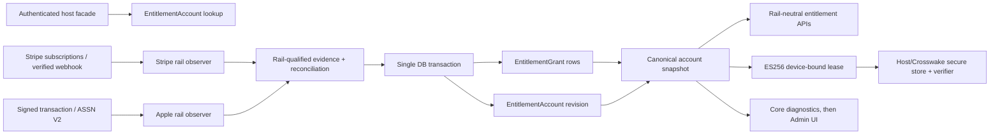

# v1.59 Architecture: Account-Scoped Multi-Rail & Offline Entitlements

**Project:** Accrue  
**Milestone:** v1.59 / SEED-006  
**Researched:** 2026-07-31  
**Confidence:** HIGH for repository integration; MEDIUM for Apple adapter details pending phase-specific Apple sandbox validation.

## Decision

Build v1.59 beside—not inside—the Stripe-shaped gateway subscription model. `Accrue.Processor` remains the configured, controllable gateway facade for existing Fake/Stripe/Braintree hosts. A new entitlement-rail layer receives verified Stripe and Apple evidence, writes rail-qualified grants, and projects their union into one `EntitlementAccount` snapshot. The legacy local subscription resolver remains the compatibility lane; a multi-rail host opts into the account projection resolver.

This resolves a real current mismatch: `accrue_customers` has a unique `(owner_type, owner_id, processor)` index, but `Billing.customer/1` and `LocalMap.lookup_customer/1` query only owner type/id with `limit: 1`. It is therefore unsafe to enable a second customer/rail row before the account projection path and explicit default-rail lookup exist. The same audit found global `Processor.__impl__/0` calls and unscoped `processor_id` reads throughout gateway reducers. v1.59 must scope gateway resources and introduce resource-aware dispatch before it can truthfully coexist with Apple.

`Billing.EntitlementSummary` remains Stripe-only advisory diagnostics. It is never an input to grants, account revision, lease issuance, or entitlement gates; v1.58's isolation test remains a merge-blocking invariant.

## Target Structure and Data Flow



### Write path

1. An observer verifies provider evidence before it reaches a projector. Stripe's observer derives grants from the existing local subscription projection only after resource/processor scoping is correct. Apple verifies signed transactions and App Store Server Notifications V2, then uses Apple status/history as repair authority.
2. The observer normalizes only entitlement facts: `rail`, `environment`, rail lineage, rail product ID, mapped Accrue plan, normalized access state/bounds, provider ordering cursor, observed time, provenance metadata, and a bounded evidence digest. It does **not** create an Apple `Subscription`, `Invoice`, payment method, or fake processor customer.
3. `GrantProjector.apply/2` locks the affected account (`FOR UPDATE`) and upserts every material grant for the relevant lineage in the same `Repo.transact` callback. It computes the before/after effective snapshot; it increments `EntitlementAccount.revision` exactly once only when effective plans, features, quantities, or known access bounds change. It appends an audit event in that transaction and schedules any reconciliation/lease-notification work via a transactional Oban outbox/job.
4. Reads fold live grants by logical plan: plans and features are set unions; a duplicate plan is present once; each quantity is the maximum effective rail quantity. A revocation, refund, or expiry retracts only its rail/environment/lineage grant. No source may erase a live grant from another source.

### Read, action, and reconnect paths

- `Accrue.Entitlements.snapshot/1` (new) resolves a host billable to its entitlement account and returns a normalized, provenance-aware snapshot. Existing `entitled?/2`, `features_for/1`, `has_active_plan?/2`, and quantity APIs retain their shape and delegate to the configured resolver; legacy hosts still use `LocalMap`.
- `Accrue.Entitlements.management_action/2` / `capabilities/1` (names to be settled in Phase 215) must take a resource or rail-qualified source. Gateway resources dispatch to their persisted processor adapter after a capability check. Apple returns `{:externally_managed, %{rail: :apple, management_url: ...}}`; it never calls Stripe cancellation, retry, swap, proration, or dunning code.
- `Accrue.Entitlements.issue_lease(account, device, audience)` rereads the effective snapshot and account revision in one transaction before signing. The signed artifact is an output, never server truth. Reconnect authenticates the host account and device, runs due rail reconciliation, then atomically returns either a newer positive lease or a signed deny tombstone. The client atomically replaces its cached proof only after verification.

## Additive Public Boundaries

| Boundary | v1.59 contract | Compatibility rule |
|---|---|---|
| `config :accrue, :processor` | Default controllable gateway processor | Unchanged; do not turn this into a rail map. |
| `:rails`, `:default_rail` | Opt-in configured rail registrations and rail capabilities | Omitted means legacy single-processor behavior. |
| Entitlement catalog | Add `products: %{rail => %{environment => [ids]}}` (or equivalent rail-qualified map) | Existing `price_ids` aliases the default rail only; boot validation rejects ambiguous multi-rail bare IDs. |
| `Billing.customer/1` | Remains get/create for the default gateway rail | Add `customer/2` for explicit gateway rail and `customers/1` as an all-rows read; never change `customer/1` to list/arbitrary selection. |
| `Accrue.Billable` | Keep `has_one :accrue_customer` for the default gateway rail | Add a distinct `has_many :accrue_customers` association/helper; do not replace the existing association. |
| Account API | `entitlement_account/1`, `snapshot/1`, device registration, lease/reconnect | Additive and host-authenticated. Account UUID is the only value used as Apple `appAccountToken`. |
| Lifecycle API | Rail/resource-aware capabilities and management results | Existing `Billing.cancel/2` and gateway APIs remain gateway-only. Apple cannot satisfy their processor callbacks. |
| Webhooks | Existing plug remains the Stripe/Braintree gateway lane; add explicit Apple observer endpoint/API | Do not coerce Apple signed JWS into `%LatticeStripe.Event{}` or `Webhook.Event`. |

The account API must accept a billable/account reference supplied by authenticated host code. It must not provide a public owner-id lookup that becomes an authorization bypass. The host remains responsible for membership, session authentication, routes, Apple client purchase invocation, secure storage, and deciding which stale-offline actions are safe.

## Persistence Contract

Use binary UUID primary keys and `Accrue.Migration` schema-qualified migrations, matching the existing package. All external IDs are scoped by `rail` and `environment`; production and sandbox collisions are expected.

### `accrue_entitlement_accounts`

| Column | Contract |
|---|---|
| `id` | UUID, stable account ID and Apple `appAccountToken`; never an email or mutable host ID. |
| `owner_type`, `owner_id` | Host billable identity, strings as in `accrue_customers`. |
| `revision` | non-null bigint/integer, starts at 0; changes only in grant-projection transaction. |
| `lock_version` | optimistic-lock support for admin/device mutation paths; projection uses row lock. |
| timestamps | UTC microsecond. |

Indexes: unique `(owner_type, owner_id)`; btree `(updated_at)` only if reconciliation reporting needs it. One entitlement account is cardinality **1:1 to an Accrue billable identity**, not one per rail or device.

### `accrue_entitlement_grants`

| Column | Contract |
|---|---|
| `account_id` | required FK to entitlement account, delete restrict. |
| `rail`, `environment` | constrained enums/validated strings (`stripe`/`apple`, `live`/`sandbox`/`test` as appropriate). |
| `lineage_id` | provider-stable subscription/original transaction lineage; no global uniqueness. |
| `source_transaction_id` | provider transaction/event identity when applicable; scoped. |
| `product_id`, `plan` | rail product and mapped logical Accrue plan; retain unmapped state/provenance but never grant it. |
| `access_state`, `effective_at`, `expires_at`, `revoked_at` | normalized bounded entitlement state; provider values remain in bounded metadata. |
| `quantity`, `ownership_type`, `provider_cursor`, `observed_at` | aggregation, provenance, monotonic ordering, and freshness inputs. |
| `evidence_digest`, `data` | hash/reference plus bounded, redacted metadata—no raw receipt/JWS body. |
| `lock_version`, timestamps | concurrency and audit support. |

Cardinality is **one account → many grants** and **one Apple lineage → many transactional observations but one current logical grant per product/access segment**. Do not use `unique(account_id, rail, environment, lineage_id)`: Apple subscriptions can legitimately contain multiple simultaneously-effective product items or a product change within a stable original transaction. Instead use a deterministic logical key such as `(account_id, rail, environment, lineage_id, product_id)` for current rows, with a partial unique index where `superseded_at IS NULL`; preserve historical observations separately. If normalized product is intentionally absent (for an unknown product), use a non-null provider product/scope surrogate so PostgreSQL NULL uniqueness cannot duplicate it.

Indexes: unique current logical-key partial index; `(account_id, access_state, expires_at)` for snapshot reads; `(rail, environment, lineage_id)` for repair; `(rail, environment, source_transaction_id)` unique when source transaction exists; `(access_state, expires_at)` partial for due expiry/reconciliation. A grant write must include its `account_id`, `rail`, and `environment` predicate on every lookup/upsert.

### `accrue_entitlement_devices`

| Column | Contract |
|---|---|
| `id` | server UUID. |
| `account_id`, `installation_id` | Account-scoped opaque client installation ID. |
| `public_key_jwk` / normalized P-256 key | required device public key; validate curve and canonical thumbprint server-side. |
| `key_thumbprint` | required and included in lease `cnf`; never accept a client-provided thumbprint without recomputing it. |
| `status`, `revoked_at`, `last_seen_at`, `last_lease_revision` | registration/revocation/reconnect state. |

Cardinality is **one account → many devices**. Unique `(account_id, installation_id)` and unique `key_thumbprint` (or `(account_id, key_thumbprint)` if a documented rotation policy allows reuse) prevent duplicate registrations. Index `(account_id, status)` and partial `(status, last_seen_at)` for stale-device operations. Revocation remains durable; do not delete a device merely to permit re-registration.

### `accrue_entitlement_observations`

This is the bounded raw-evidence/audit queue, distinct from `accrue_webhook_events`. It records verified evidence receipt and quarantine state without forcing Apple into the Stripe event schema.

Required columns: `rail`, `environment`, `provider_event_id`, `provider_transaction_id`, `lineage_id`, `kind`, `received_at`, `provider_signed_at`, `status`, `attempt_count`, `next_retry_at`, `account_id` nullable until verified link, `evidence_digest`, bounded/redacted `data`, and `processed_at`. Store a short encrypted/verifiable payload reference only if server-side Apple verification/replay requires it; never expose it through admin or telemetry.

Indexes: unique `(rail, environment, provider_event_id)` when the provider supplies an event ID; unique `(rail, environment, provider_transaction_id, kind)` for transaction submissions without an event ID; partial `(status, next_retry_at)` for quarantine/retry; `(account_id, received_at desc)` for diagnostics. A duplicate must return success/no-op after verification identity is known and must not increment the account revision.

## Projection Transactions and Ordering

`GrantProjector` is the only writer of grants and account revision. Its transaction is:

1. Load/create the account by `(owner_type, owner_id)` under the unique constraint. Apple automatic linkage creates it only from an authenticated host purchase initiation or a verified `appAccountToken`; unmatched evidence is not allowed to create an arbitrary account.
2. Lock the account row, load affected current grant rows with rail/environment/lineage predicates, and compare provider cursor plus signed/provider timestamps. Exact duplicates are idempotent; older evidence cannot overwrite newer authoritative state.
3. Upsert/supersede grants, compute the effective snapshot before and after, and update revision with `set revision = revision + 1` only on an effective delta. Update reconciliation metadata and append an audit event in the same transaction.
4. Commit. Only then enqueue repair/notification work. Lease issuance always reads the committed revision; it must never sign from an in-memory pre-commit snapshot.

This makes revision an optimistic cache validator, not a sequence of every receipt. The value changes for entitlement-affecting differences, including an earlier known end/revocation, but not for a duplicate delivery or a provenance-only refresh. A positive lease with a lower revision is replaced on reconnect. A deny tombstone carries at least account ID, device thumbprint, revision, `jti`, `iat`, `nbf`, explicit signed expiry, and reason code; it wins over any cached positive proof after authenticated reconnect.

## Resource-Aware Dispatch and Current Remediation

Do not widen the `Accrue.Processor` behaviour with Apple lifecycle callbacks. Instead add a small registry:

```elixir
def adapter_for(%{processor: processor}) when is_binary(processor),
  do: Accrue.Rails.gateway_adapter(processor)

def management_for(%Accrue.Entitlements.Grant{rail: :apple}),
  do: {:externally_managed, %{rail: :apple}}
```

Gateway operations receive a persisted resource and resolve its adapter from `resource.processor`; creation uses explicit `rail:`/default rail, never a process-global arbitrary resource selection. The registry may initially map `"stripe"`, `"braintree"`, and `"fake"` to adapters, preserving `Processor.__impl__/0` only for legacy default creation. All high-risk existing callers must be audited before multi-rail configuration is enabled:

- `Billing.fetch_customer/2` and `LocalMap.lookup_customer/1`: add processor/default-rail predicate to legacy path; use account lookup for opt-in path.
- `DefaultHandler` contains many `Repo.get_by(Customer|Subscription, processor_id: ...)` lookups. Every one must add `processor:`; subscription items and related projections must scope by parent/subscription processor too.
- `Checkout`, meter events, invoice/payment/refund actions, Portal resolution, and dunning contain bare processor ID lookups or `Processor.__impl__()` calls. Resolve adapter from the target gateway resource; reject non-gateway rails before any mutation.
- `DunningSweeper` must query only controllable gateway subscriptions and carry `processor` to the adapter. Apple grants never enter `accrue_subscriptions`, so this is both a data-model and query exclusion test.
- `Webhook.Event` currently has a closed processor atom map and `Ingest` requires `%LatticeStripe.Event{}`. Keep that lane closed for gateway webhooks; Apple needs `AppleObservation.Ingest` and a typed observer event, avoiding accidental processor-facade fetches.

Phase 215 should add static/contract tests that fail on unscoped `processor_id` lookup in multi-rail-sensitive modules, much like v1.58's entitlement-summary isolation gate.

## Apple Observer, Linking, and Repair

Apple uses a distinct credential boundary from ES256 offline signing. The Apple client/server-notification verifier needs Apple App Store credentials, environment-specific trust/key material, issuer/audience/bundle-id/app-id validation, and App Store Server API credentials. Lease signing needs an Accrue-owned P-256 private key provider plus published verification keys (`kid`); it must not reuse an Apple private key, Apple key ID, or App Store server credential configuration. Both are host runtime secrets/configuration; Accrue defines behaviours and validates wiring but does not own an HTTP client or secret process.

Observer flow:

1. Host obtains the authenticated entitlement-account UUID and passes it as StoreKit `appAccountToken` when initiating a purchase. The host never derives it from email.
2. Restore/submission endpoint authenticates the caller, receives signed transaction material, verifies it server-side, validates environment/product/application binding, and checks that its verified app-account token equals the caller's entitlement account. A mismatch is quarantine/fail-closed, not a transfer.
3. App Store Server Notifications V2 are signature-verified before inserting an observation. Their transaction/original transaction data is reduced into the same lineage-scoped projector. Duplicate and out-of-order observations converge through the cursor rules.
4. Notification data is a prompt to reconcile, not sole authority. Reconciliation calls Apple subscription status/history for due lineages, then projects signed/current status. Missed notification, temporary Apple API outage, unmatched token, and out-of-order state go to retry/quarantine with backoff and operator-visible reason codes.
5. Automatic linking is only the verified-token path. There is no email matching, product-only matching, device-account matching, or unverified client-claim fallback. Transfer/merge and Family Sharing remain unsupported.

## Duplicate-Purchase Eligibility

Before a host starts a new Stripe checkout or Apple purchase, call a rail-neutral eligibility query over the account snapshot:

`eligible_to_purchase?(account, target_rail, logical_plan)` returns `:eligible`, `{:warn, existing_sources}`, or `{:block, existing_sources, reason}` according to the v1 fixed policy. It looks at live, mapped grants and their known end bounds—not arbitrary customer rows or advisory Stripe summaries. The result is advisory to host UX unless the host explicitly selects the documented block policy; it must never cancel an existing subscription, migrate ownership, infer a refund, or silently select the “best” rail. The purchase command rechecks immediately before creating a controllable Stripe subscription; Apple remains client-controlled, so a server-side post-purchase projector records the conflict diagnostically rather than undoing it.

## Offline Lease States

| State | Server-provided proof | Host/Crosswake policy |
|---|---|---|
| `fresh` | Valid ES256 JWS, account/device/audience match, `now <= fresh_until` | Full entitled access. |
| `stale_offline` | Signature/bindings remain valid but `now > fresh_until`; no newer deny/revision is known | Preserve downloaded lessons and progress; block new premium downloads and other value-expanding actions. |
| `reconnect_required` | `now > hard_expiry`, invalid/rollback/key-revoked proof, or unavailable proof | Preserve app shell/local data; premium actions fail closed and UI requests reconnect. |
| `denied` | Valid device-bound deny tombstone | Do not reselect an older positive lease; reconnect/support path required. |

Claims include protocol version, `alg` fixed to ES256, `kid`, issuer, audience, token ID, account ID, device key thumbprint, revision, `iat`, `nbf`, `fresh_until`, an explicit signed `exp` when policy/provider bounds require one, snapshot plans/features/quantities, and compact deny/revocation state. Verification pins accepted algorithm, issuer and audience; uses a secure monotonic high-water mark to detect material clock rollback; bounds future skew; and rejects a key/account/device mismatch. The 30-day revalidation target shortens to an earlier effective grant end. Crossing `fresh_until` produces `stale_offline`, not a hidden 72-hour timer or automatic denial.

Retain old public verification keys until no actually issued proof using them can remain valid, plus permitted clock skew and reconnect buffer. Normal rotation signs with a new `kid` while old keys verify old leases. Key compromise changes the issuer key policy, can revoke affected devices/force online renewal, and uses deny tombstones after reconnect; it cannot magically revoke an already-valid offline lease without the client seeing new trusted policy.

## Legacy Opt-In, Backfill, and Cutover

1. **Foundation (no behavior switch):** add schema, rails registry, rail-qualified catalog validation, explicit gateway customer lookup, resource-aware routing, and observer interfaces. Existing migrations do not rewrite customers/subscriptions.
2. **Backfill:** create exactly one `EntitlementAccount` for each existing billable identity. Derive Stripe grants from current mapped entitling local subscriptions in deterministic chunks. Compare each generated snapshot to the legacy `LocalMap` output; record mismatch diagnostics and do not enable it for that account until clean. This job is resumable/idempotent by account and uses the partial uniqueness indexes.
3. **Opt-in:** `multi_rail_entitlements: :disabled | :shadow | :enabled`, default `:disabled`. `:shadow` computes and records divergence only, keeping `LocalMap` as gate authority. `:enabled` uses canonical account snapshot for configured accounts; a single-processor host with no rails config remains on its old resolver.
4. **Cutover:** require shadow parity over a defined window, no unresolved unmapped products, scoped gateway reducer audit passing, and rollback plan. Enable per host/account cohort, not via a global implicit config flip. Rollback returns gates to legacy resolver but preserves account/grant evidence for repair; it never deletes grants or silently mutates gateway subscriptions.
5. **Future cleanup:** do not make `EntitlementAccount` a replacement for `Customer`. Keep both models: customer is gateway money/lifecycle identity, account is cross-rail access identity.

## Diagnostics, Repair, and Package Boundaries

Core owns typed, privacy-safe reads: account revision/snapshot; grant provenance and normalized bounds; observation/quarantine state; last/next reconciliation; device status and lease horizon; and eligibility/management result. It emits allowlisted telemetry with account IDs or hashes, rail/environment/status/reason and counts—never email, raw receipts, JWS, transaction bodies, `appAccountToken` in logs, or lease contents.

`accrue_admin` presents these core diagnostics and invokes replay/reconcile/device-revoke/key-status operations; it must not own reconciliation logic or a second state machine. `accrue_portal` remains a gateway customer billing UI. It can show a rail-aware “managed by Apple” guidance state through core capability results, but must not expose an Apple cancellation button wired to gateway mutation. The B2C Alpha reference host is a separate minimal Phoenix/Crosswake proof: it owns auth, account selection, iOS StoreKit call, client JWS verifier/Keychain storage, action-level stale policy, routes, and Oban supervision. It must use anonymized fixtures and must not become a second general-purpose mobile SDK or leak adopter identity into samples, telemetry, tokens, or docs.

Automatic repair is a scheduled/account-targeted core worker, not a human runbook disguised as a feature: reconcile Apple lineages that are stale or notification-failed; retry quarantined evidence after account/token availability changes; identify stale devices; inspect Stripe gateway subscription changes through the new Stripe observer; and expose bounded replay with idempotency keys. Operator runbooks cover provider outage, unmatched Apple evidence, stale lease/device, missed notifications, and signing key rotation. Reconciliation failure is visible without ever granting from unverified evidence.

## Build Order and Phase Dependencies

| Phase | Deliverable and hard dependency |
|---|---|
| **215 — Contract and additive foundation** | Freeze rail/source capability matrix, config/catalog shape, migrations, core account/grant/device/observation schemas, rail registry, and scoped gateway audit. This must land before any second rail row can be created. |
| **216 — Canonical projection and compatibility** | `GrantProjector`, revision transaction, snapshot resolver, legacy default-rail fixes, shadow/backfill tooling, resource-aware gateway dispatch, and cross-rail survivor/duplicate-plan tests. Depends on 215. |
| **217 — Apple observation and repair** | Apple credential behaviour, verified signed transaction/ASSN ingest, authenticated `appAccountToken` linking, lineage idempotency, status/history reconcile, quarantine and externally-managed capability result. Depends on 215/216; no lease can rely on unverified Apple input. |
| **218 — Offline protocol** | Device registration, key-provider behaviour/JWKS publication, ES256 issuer/verifier fixtures, freshness/degraded/deny/reconnect state machine, atomic revision check and key rotation. Depends on 216 snapshot and should consume Apple evidence only through 217's projector. |
| **219 — B2C Alpha proof and operations** | Reference-host vertical flows, admin/core diagnostics, automatic repair workers/runbooks, docs/matrices/release gates. Depends on all earlier phases. |

Merge-blocking tests: legacy single-processor compatibility; no unscoped cross-processor ID collision; same-plan multi-item/multi-rail dedupe; rail-specific revocation survivor; no Apple dunning/mutation; duplicate/delayed/out-of-order Apple evidence; unmatched evidence grants nothing; snapshot/revision atomicity; lease algorithm/audience/device/clock defenses; deny tombstone precedence; and the existing advisory-summary `gate → seam` prohibition.

## Sources and Repository Evidence

- [Multi-Rail and Offline Entitlements architecture signal](MULTI-RAIL-OFFLINE-ENTITLEMENTS.md) — accepted v1.59 direction and protocol constraints (HIGH).
- [Entitlement-source capability matrix](../entitlement-source-capability-matrix.md) — rail support contract and aggregation rules (HIGH).
- [Core architecture guide](../../accrue/guides/architecture.md) — host/core/admin/portal ownership and transactional projection conventions (HIGH).
- `accrue/lib/accrue/billing.ex`, `accrue/lib/accrue/entitlements/resolver/local_map.ex`, `accrue/lib/accrue/processor.ex`, and `accrue/lib/accrue/webhook/default_handler.ex` — current unscoped/default-dispatch risks (HIGH, repository inspection).
- [Apple StoreKit current entitlements](https://developer.apple.com/documentation/storekit/transaction/currententitlements), [App Store Server API](https://developer.apple.com/documentation/appstoreserverapi), and [App Store Server Notifications](https://developer.apple.com/documentation/appstoreservernotifications) — Apple observation/reconciliation source family (MEDIUM until phase-specific integration validation).
- [RFC 8725: JSON Web Token Best Current Practices](https://www.rfc-editor.org/rfc/rfc8725) — JWS algorithm/issuer/audience validation guidance (HIGH).
