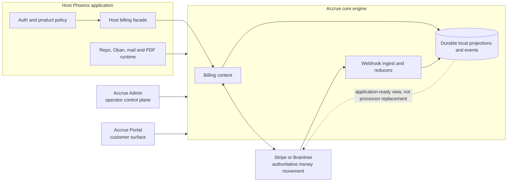
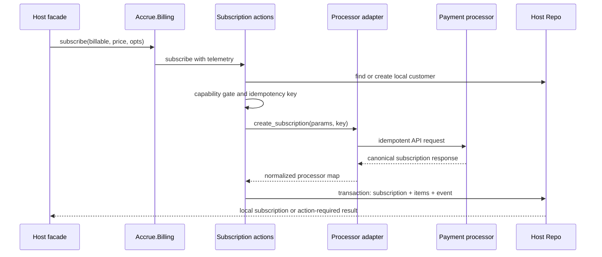
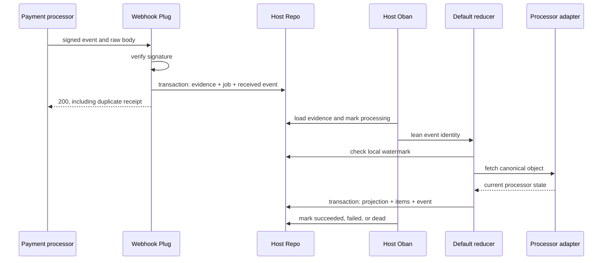
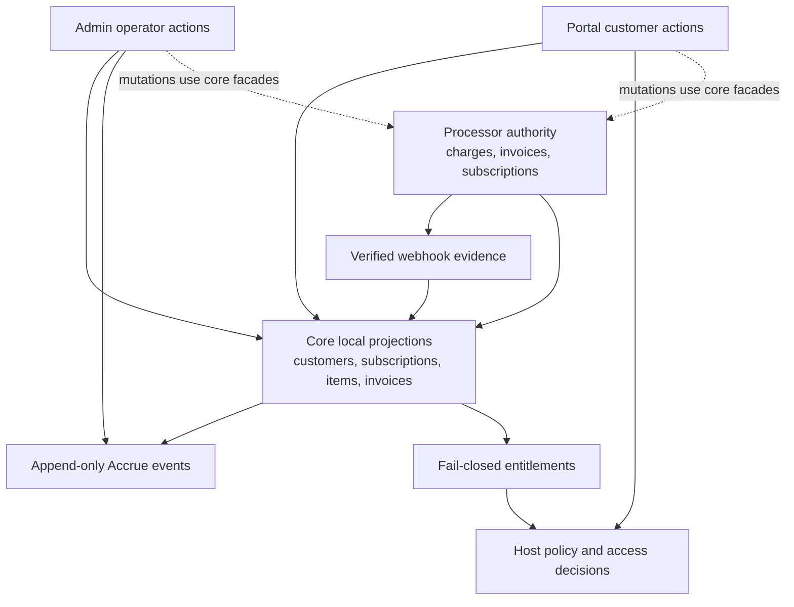

# Architecture

Accrue gives a Phoenix application a durable local billing model without pretending that a
local database can replace a payment processor. Stripe or Braintree remains authoritative for
money movement. Accrue turns that remote state into transactional local projections that the host
can query, audit, and use for product decisions.

This guide follows two journeys through that boundary: a direct subscription command going out,
then a signed webhook coming back. Afterward, continue with the
[Code walkthrough](code-walkthrough.md) to see the representative functions behind the same route.

## Accrue in one picture

The host application owns the front door. Accrue owns reusable billing semantics behind it. Admin
and Portal consume those semantics; neither becomes a second billing engine.



That last dotted relationship is the important one. A subscription row is the application's
durable view of processor state. It makes ordinary reads fast and dependable, but remote money
movement is still reconciled through the adapter and webhooks.

## Vocabulary for the trip

A **processor** is the configured adapter and the remote payment system behind it. A
**projection** is a processor response normalized into Accrue's local Ecto schemas. A **reducer**
turns a verified event into a projection update. An **entitlement** translates that local billing
state into an application-facing access decision.

Two mechanics make the boundary safe. **Idempotency** gives a requested remote mutation a stable
identity so retries do not create a second subscription. A **watermark** records the event time and
ID associated with a local projection so reducers can recognize older work.

## Journey 1: The application asks billing to change

The outward journey begins in host-owned code. That is where organization scope, authorization,
and product rules belong. A generated facade starts deliberately thin so the host can add those
rules without teaching controllers or LiveViews about processor details.

```elixir
def subscribe(billable, price_id, opts \\ []) do
  Billing.subscribe(billable, price_id, opts)
end
```

`Accrue.Billing.subscribe/3` wraps the operation in billing telemetry and delegates to subscription
actions. If the value is not already an `Accrue.Billing.Customer`, Accrue lazily resolves or creates
the customer first. The operation then checks that the configured adapter officially supports
direct creation.



The adapter boundary is explicit. The behaviour says what Accrue needs; runtime configuration picks
the implementation. Fake exercises this same contract for tests and demos, but it does not erase
the differences between production processors.

```elixir
@callback create_subscription(params(), opts()) :: result()

@doc false
@spec __impl__() :: module()
def __impl__, do: Application.get_env(:accrue, :processor, Accrue.Processor.Fake)
```

Before calling the adapter, subscription actions derive an operation ID and a deterministic
idempotency key. Stripe receives an expanded direct-create request; Braintree's supported direct
path requires a host-acquired vault reference. On success, the returned processor map is decomposed
into local subscription attributes and items.

The database write and append-only event are one outcome, not two loosely related writes:

```elixir
Repo.transact(fn ->
  with :ok <- ensure_valid_tax_location(processor_subscription, opts),
       {:ok, attrs} <- SubscriptionProjection.decompose(processor_subscription),
       {:ok, subscription} <- insert_subscription(customer.id, attrs),
       {:ok, _items} <- upsert_items(subscription, processor_subscription),
       {:ok, _event} <-
         record_event("subscription.created", subscription, %{price_id: price_id}) do
    {:ok, Repo.preload(subscription, :subscription_items, force: true)}
  end
end)
```

The result may be a subscription, an error, or an action-required result for customer
authentication. That shape lets the host decide how its UI handles SCA while the core retains one
subscription operation.

## Journey 2: The processor reports what happened

The command response is only the beginning. Processor state can later change through renewals,
failed payments, disputes, dashboard actions, or retries. Webhooks are duplicated, delayed, and
occasionally out of order, so Accrue treats receipt as distributed-system input rather than a
controller callback that directly edits rows.



`Accrue.Webhook.CachingBodyReader` preserves the bytes needed for signature verification.
`Accrue.Webhook.Plug` fails closed on a missing or invalid signature. Once verified,
`Accrue.Webhook.Ingest` stores the raw evidence, an Oban dispatch job, and a `webhook.received`
ledger entry in one transaction. A uniqueness constraint on processor plus processor event ID makes
a duplicate delivery return 200 without creating a second job or ledger row.

The queued worker does not hand the full webhook payload to the reducer. It constructs a lean value:

```elixir
%Accrue.Webhook.Event{
  type: row.type,
  object_id: object_id,
  livemode: row.livemode,
  created_at: row.received_at,
  processor_event_id: row.processor_event_id,
  processor: processor
}
```

That shape forces built-in reducers to refetch the current object through the processor adapter.
The payload remains durable evidence, but it is not silently promoted to current truth. The default
handler runs before configured user handlers; a built-in failure retries the Oban job, while a user
handler crash is isolated and reported. After 25 attempts, the event becomes dead-lettered and can
be replayed through the core DLQ API or Admin.

Two current implementation details matter when reasoning about ordering:

- Queued events set the normalized `created_at` from the persisted receipt time. The raw/Fake path
  can carry the processor-created timestamp. Canonical refetch, not the queued timestamp watermark,
  is therefore the primary convergence guarantee on the queued path.
- Braintree receipt can be verified and persisted, but the bounded processor conversion in
  `Accrue.Webhook.Event` currently omits `"braintree"`. Its queued job fails before the Braintree
  handler runs. Direct Braintree subscription creation is a separate path and is unaffected.

These are implementation constraints to preserve in tests and change deliberately, not stronger
guarantees to infer from the surrounding design.

## The data model carries the architecture

The schemas group into a few roles. Customers connect a host-owned billable identity to a processor
customer. Subscriptions and items are queryable projections. Invoices, charges, refunds, payment
methods, and schedules follow the same local-view pattern. Webhook events retain delivery evidence;
Accrue events retain an append-only audit history.

Lifecycle predicates keep product code away from fragile raw status comparisons. For example, a
paid-through subscription scheduled to cancel can still grant access, while an active-looking row
with a pause overlay cannot. `Accrue.Billing.Subscription.entitling?/1` composes active, paused, and
terminated semantics into that single decision.

The corresponding `Accrue.Billing.Query.entitling/1` expression is the database twin of that
predicate. The default entitlement resolver joins those qualifying subscriptions to their items,
maps processor price IDs into configured plans, unions features, and caps quantities. It makes no
processor call on the read path and fails closed when state is missing, malformed, unmapped, or
unavailable.

```elixir
if Accrue.Entitlements.entitled?(organization, :advanced_reports) do
  show_advanced_reports()
else
  deny_paid_feature()
end
```

Optional Stripe-native entitlement summaries are observational cache data. They never grant access
in place of the local resolver.



## Cross-cutting mechanics

Ecto supplies schemas, queries, transactions, optimistic locks, and constraint handling. Accrue
defines the billing invariants around those tools; the host supplies and supervises the configured
Repo. Oban supplies durable execution and retry state. Accrue defines job payloads, queues, retry
policy, and dead-letter behavior; the host starts Oban with the required queues.

Swoosh delivers transactional mail, and Rendro is the default invoice renderer. The optional
ChromicPDF adapter can provide a browser-backed compatibility path. Accrue owns billing-specific
templates and dispatch decisions; the host owns adapter configuration, credentials, and any required
runtime process.

Telemetry spans surround public billing commands, webhook receipt, handler failures, and entitlement
checks. Optional OpenTelemetry integration can carry those signals into a host's tracing system.
Telemetry is operational evidence, whereas `Accrue.Events` is the tamper-evident domain audit ledger;
one should not substitute for the other.

Accrue's OTP application validates configuration and safety assumptions, then starts an empty
supervisor. Repo, Oban, mail delivery infrastructure, PDF pools, and HTTP clients remain in the
host's supervision tree. This keeps a library from quietly owning processes whose lifecycle belongs
to the application.

## How the sibling packages fit

| Boundary | Owns | Uses without owning |
|---|---|---|
| Host application | Facade, routes, auth/session, billable scope, product policy, runtime supervision | Core billing operations and local read models |
| Accrue core | Processor contracts, billing operations, lifecycle rules, projections, webhook convergence, entitlements, audit | Host Repo and supervised infrastructure |
| Accrue Admin | Operator navigation, authorization/step-up UX, diagnostics, replay and control-plane presentation | Core schemas, queries, billing facade, and DLQ semantics |
| Accrue Portal | Mounted customer billing UI and provider-honest local checkout/portal flows | Core billing facade and local projections |
| Stripe or Braintree | Processor-side money movement and canonical remote objects | Idempotency keys and requests from its adapter |

Admin reads core projections and invokes core operations; it must not create a parallel subscription
state machine. Portal presents customer-facing state and actions through the same boundary. See the
[Admin guide](https://hexdocs.pm/accrue_admin/admin_ui.html) and
[Portal package guide](https://hexdocs.pm/accrue_portal/readme.html) for mounting and UI concerns.

## Module atlas

| Question | Start with | Then inspect |
|---|---|---|
| Where does a host billing command enter? | `Accrue.Billing` | `Accrue.Billing.SubscriptionActions` |
| How is an adapter selected and constrained? | `Accrue.Processor` | `Accrue.Processor.Capabilities` and one configured adapter |
| How does remote subscription data become local rows? | `Accrue.Billing.SubscriptionProjection` | `Accrue.Billing.Subscription` and `Accrue.Billing.SubscriptionItem` |
| How is webhook receipt made durable? | `Accrue.Webhook.Plug` | `Accrue.Webhook.Ingest` and `Accrue.Webhook.WebhookEvent` |
| How does async state converge? | `Accrue.Webhook.DispatchWorker` | `Accrue.Webhook.DefaultHandler` |
| What grants product access? | `Accrue.Entitlements` | `Accrue.Entitlements.Resolver.LocalMap` and `Accrue.Billing.Query` |
| What is durable audit evidence? | `Accrue.Events` | `Accrue.Events.Event` |

## Code-reading routes

- **Subscribe:** `Accrue.Billing` → `Accrue.Billing.SubscriptionActions` → `Accrue.Processor` →
  `Accrue.Billing.SubscriptionProjection`. Ask where authorization ends, idempotency begins, and
  local atomicity is established.
- **Webhook:** `Accrue.Webhook.Plug` → `Accrue.Webhook.Ingest` →
  `Accrue.Webhook.DispatchWorker` → `Accrue.Webhook.DefaultHandler`. Ask what evidence survives each
  failure and which failures retry.
- **Entitlements:** `Accrue.Entitlements` → `Accrue.Entitlements.Resolver.LocalMap` →
  `Accrue.Billing.Query`. Ask why every uncertain result denies access.
- **Dunning:** `Accrue.Jobs.DunningSweeper` → `Accrue.Workers.DunningStep` → billing lifecycle
  predicates. Ask how a past-due campaign starts, stops, and remains idempotent.
- **Invoice and PDF:** `Accrue.Billing.InvoiceActions` → `Accrue.InvoiceRenderer` → the configured
  renderer. Ask which facts are processor-owned and which presentation work is host-supervised.
- **Audit:** `Accrue.Events` → `Accrue.Events.Event`. Ask which state changes share a transaction with
  their ledger row.
- **Admin:** `AccrueAdmin.Router` → an Admin LiveView → core queries or facade. Ask whether an operator
  action preserves host authorization and core semantics.
- **Portal:** `AccruePortal.Router` → `AccruePortal.BillingReadModel` → `Accrue.Billing`. Ask whether a
  customer action remains provider-honest without duplicating billing logic.

## Changing Accrue safely

Protect the authority boundary first. A processor response may update a projection; a projection must
not be mistaken for permission to invent remote money movement. Keep local row changes and audit
records atomic. Preserve deterministic idempotency keys across retries. Treat webhook payloads as
verified evidence and canonical refetch as the convergence step.

Lifecycle changes must update the in-memory predicate, its query twin, entitlement behavior, and the
truth-table documentation together. Processor changes must update capabilities and maintain the Fake
contract without claiming production parity that the real adapter does not provide. Package changes
must keep host policy in the host and billing semantics in core.

The fastest executable reading companions are the duplicate-ingest and out-of-order reducer tests.
For the wider safety net, read [Lifecycle semantics](lifecycle_semantics.md),
[Testing](testing.md), and [Production readiness](production-readiness.md).

## Where to go next

Continue with the [Code walkthrough](code-walkthrough.md) for the same two journeys in representative
source. Then use the task guides for [Webhooks](webhooks.md),
[Webhook gotchas](webhook_gotchas.md), [Entitlements](entitlements.md),
[Metering](metering.md), [Dunning](dunning.md), [Email](email.md), and
[PDF rendering](pdf.md).
